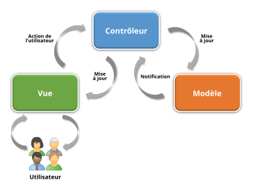
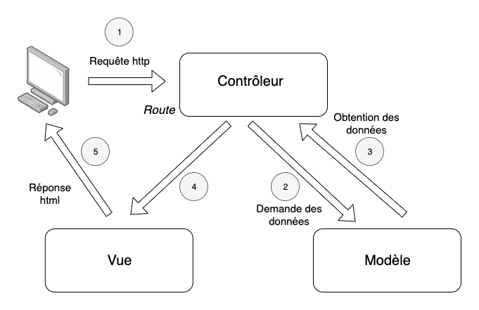

<H2>DAILY MEETING</H2>

Objectifs du Daily Meeting
Communication : Faciliter la communication entre les membres de l'équipe.
------------
Coordination : Coordonner les efforts et aligner les actions de chacun.
Identification des obstacles : Identifier rapidement les obstacles ou les problèmes qui pourraient empêcher l'équipe d'atteindre ses objectifs.
------------------------------
Caractéristiques principales
Fréquence : Quotidienne, généralement en début de journée.
Durée : Brève, typiquement 15 minutes ou moins.
Participants : Toute l'équipe de développement, le Scrum Master et parfois le Product Owner.
Format : Debout, pour encourager la brièveté.
Contenu
-----------------------------------
Chaque membre de l'équipe répond à trois questions :
-
Qu'ai-je fait hier ? : Décrire brièvement ce qui a été accompli depuis la dernière réunion.
Que vais-je faire aujourd'hui ? : Expliquer ce qui est prévu pour la journée.
--------------------------------------
Quels sont les obstacles ? : Mentionner tout problème ou obstacle rencontré qui pourrait empêcher d'atteindre les objectifs.
Bénéfices
Transparence : Chacun est au courant des progrès des autres membres de l'équipe.
Adaptabilité : L'équipe peut s'ajuster rapidement en fonction des besoins et des défis.
Responsabilité : Chaque membre se sent responsable de ses tâches et de la progression globale du projet.
-------------------------------------------
EN GROS LE DAILY MEETING EST UNE RÉUNION

!

# Projet Method Agile

##  _Vision product_ REZ' GAMES (RETRO)
 
Offrir un site de confiance qui permet de revaloriser et de certifier des produits issus des tendances rétro de la culture Geek
 
### _POUR_
 
Pour tout les gamers et passionnés de culture Geek
 
### _QUI SOUHAITENT_
 
Revendre ou acheter des produits issus de la culture Geek
Une analyse, une certification et une estimation tarifaire
 
### _NOTRE PRODUIT EST_
 
Un site d'Achat, de revente et d'analyse de jeux vidéos et de produits lié à la culture geek
 
### _QUI_
 
Offrir une seconde vie au marché Geek retro et assurer la remise en valeur des collections
 
### _A LA DIFFERENCE DE_
 
Estimation en rapport avec les argus du net
Service de certification
Notification juste et précise
 
### _PERMET DE_
Racheter et revendre des produits rétro Geek au prix du marché
Remise en valeur des collections

---------------------------

Planning Poker : Une technique utilisée en Agile pour estimer l’effort requis pour les tâches de développement. Les membres de l’équipe utilisent des cartes avec des nombres (séquence de Fibonacci) pour indiquer leurs estimations, puis discutent des différences pour parvenir à un consensus.

Product Backlog : Une liste de priorités de travail pour l’équipe de développement qui est dérivée de la feuille de route et de ses exigences. Il est maintenu par le Product Owner.

Product Owner : Personne chargée de définir les caractéristiques du produit et de s’assurer que l’équipe de développement apporte de la valeur à l’entreprise. Le Product Owner gère le Product Backlog et hiérarchise les articles en fonction de la valeur métier et des besoins des clients.

Diffusion : Ensemble de produits livrables mis à la disposition des utilisateurs. Dans Scrum, les sorties peuvent avoir lieu à la fin d’un sprint ou après plusieurs sprints, selon le plan de sortie.

Scrum Master : Un facilitateur et un coach pour l’équipe Scrum, responsable de s’assurer que le processus Scrum est suivi et d’éliminer tous les obstacles que l’équipe peut rencontrer.

Sprint : Une période limitée dans le temps (habituellement de 2 à 4 semaines) au cours de laquelle des travaux particuliers doivent être effectués et prêts à être examinés. Les sprints sont les éléments de base du développement Agile.

Planification du sprint : Une réunion au début de chaque sprint où l’équipe Scrum discute de ce qu’elle accomplira pendant le sprint. L’équipe sélectionne les éléments du Product Backlog sur lesquels travailler et crée un Sprint Backlog.

Sprint Review : Une réunion tenue à la fin de chaque Sprint pour inspecter l’incrément et adapter le Product Backlog si nécessaire. L’équipe présente les travaux réalisés lors du Sprint aux parties prenantes.

Rétrospective : Aussi connue sous le nom de Sprint Retrospective, cette réunion se tient après la Sprint Review et avant la prochaine Sprint Planning. L’équipe réfléchit sur le sprint passé pour identifier et s’entendre sur des améliorations continues des processus.

User Story : Un outil utilisé dans Agile pour capturer une description d’une fonctionnalité logicielle du point de vue de l’utilisateur final. Les user stories sont des descriptions courtes et simples une fonctionnalité présentée du point de vue d’un utilisateur ou d’un client.

Valeur métier : Français pour « valeur opérationnelle », ce terme désigne la valeur qu’une caractéristique ou une tâche apporte à l’entreprise. C’est un facteur essentiel pour prioriser le Product Backlog.

Vélocité : Français pour "vélocité", c’est une mesure de la quantité de travail qu’une équipe peut accomplir lors d’un seul sprint. Il est utilisé pour prédire combien de travail l’équipe peut faire dans les prochains sprints.

Chacun de ces termes fait partie intégrante du cadre Scrum, qui met l’accent sur les progrès itératifs grâce à une inspection et une adaptation régulières. Planning Poker permet de s’assurer que tous les membres de l’équipe contribuent et comprennent les estimations de l’effort, ce qui conduit à une planification plus précise et réaliste.

NÔTRE PLANNING POKER = 
1 = xl
2 = m
3 = m
4 = s
5 = m
6= xl
6 = s
7 = s 
8 = s 
9 = m
