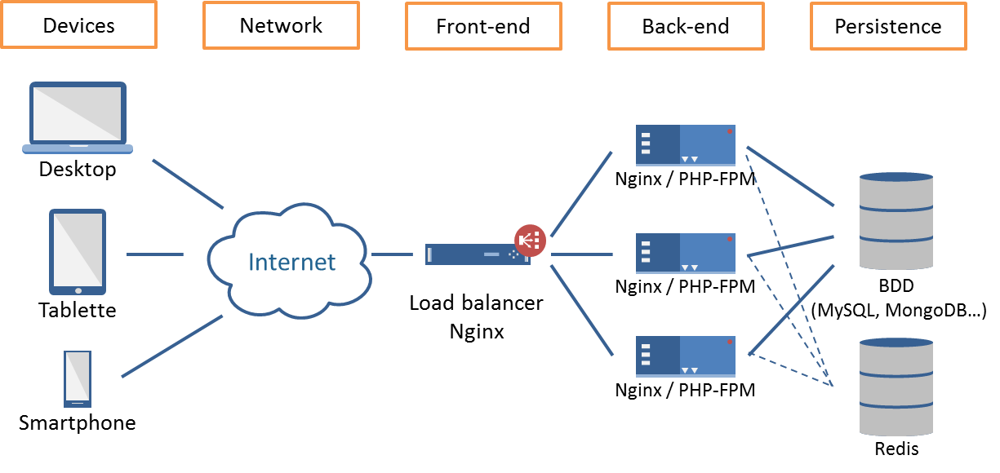

AND
(en majuscule et en anglais)	Chercher 2 ou plusieurs termes à la fois	J’obtiens tous les résultats qui contiennent les mots clés liés par AND.	Architecte AND Bruxelles
OR
(en majuscule et en anglais)	Associer des recherches.	Google m’indique tous les résultats lié à l’un ou l’autre terme de recherche ou les deux ensembles.	Marathon OR course
NOT
Tiret (-)
(pas d’espace entre le tiret  et le mot)	Exclure un ou plusieurs termes d’une recherche	Utile pour orienter les résultats de Google et lui faire comprendre qu’il ne doit pas lister certaines variations d’un terme.
Vous pouvez exclure plusieurs termes.	Recette tarte NOT chocolat
Tesla -moteurs -voiture
Guillemets
“…”	Chercher une expression exacte. Sur une partie ou l’ensemble de la requête.	Utile pour trouver une personne précise (Prénom + Nom), une forme précise (singulier ou pluriel, féminin ou masculin) ou encore à quoi correspond un message d’erreur, etc.	Discount “basket Nike”
Astérisque (*)	Remplacer un mot inconnu ou plusieurs lettres par un joker (*)	utile pour retrouver une expression oubliée ou un produit que vous ne connaissez pas bien	Ingenieur * electrique
Tilde
[∼] (pas d’espace entre le tilde  et le mot)	Inclure les synonymes du terme placé entre crochets	Utile pour englober tous les mots qui font référence à une idée	
Parenthèses	Grouper des parties de requête	Permet de contrôle l’ordre dans lequel Google effectue la recherche	(inbound OR outbound) marketing
..
(deux points entre deux chiffres))	Rechercher une fourchette entre deux chiffres	Pratique si l’on veut trouver un objet dans une gamme de prix donnée ou pour trouver des musiques d’une certaine époque.	Appareil photo €100..€500

site:	Limiter la recherche à un site précis ou connaître toutes les pages indexées d’un site	Pratique si le contenu d’un site est important et qu’il ne comprend pas de moteur de recherche interne.	Outils site:c-marketing.eu
filetype:	Rechercher un type de fichier spécifique (PDF, JPG ou autre)	Google regorge de documents à télécharger. Vous pouvez préciser le type de fichier recherché sur un sujet donnée.	Linkedin filetype:PDF
link:	Trouver les liens qui pointent vers un site	Attention cet opérateur n’est plus suivi depuis début 2017.	link:google.com
inurl:	Limiter la recherche aux pages incluant le mot clef dans leur adresse internet		
intitle:	Chercher un mot/expression clé spécifique dans le titre d’une page/document	Attention, Google modifie parfois les titres, ce qui peut avoir un impact sur les résultats.	Intitle:”top 10¨*” inbound marketing
intext:	Limiter la recherche au corps de la page / du document	Force Google à trouver le texte dans le corps du document.	
related:	Rechercher des sites ou des pages similaires	Fait apparaître une liste de sites du même genre que celui que l’on a indiqué.	related:facebook.com

<h2>SITE INTERNET UTILES :</h2>
1. Hacker News

2. SlashDot

3. Reddit

3. DZone

4. A List Apart

5. SitePoint

7.Grafikart

8.MDN

FLOSSMANUAL PROCESSING

Dévellopez.com

9.Free-work

10.Human coder

ALGO= CODECOMBAT/CITIZENCODE

FreecodecupJS , python

11.OPEN CLASS ROOM

12.StackOverflow

-----------------------

Pour vous, qu’est ce qu’un réseau ?

// Un réseau est un ensemble de dispositif, personnes, entreprises, ect...

----------------
Quel est le lien entre la notion de réseau et Internet?

// un réseau de données

-------------
Quelle est la différence entre Internet et le Web ? Ou a-t-il été inventé ?(Tips : c’est pas si loin d’où vous êtes )

// L'Internet est l'infrastructure physique et logique qui permet la connexion entre des millions de réseaux à travers le monde.

// Services offerts par Internet. Il s'agit d'un système d'informations interconnectées accessibles via des pages Web

// as été inventé au CERN

------------
Quels sont les différents types de réseaux informatiques ? Pour chaque type de réseau, donner un exemple concret.
Qu’est ce qu’une interface réseau ?
// Réseau local (LAN) Un réseau local est un système interconnecté limité en termes de taille et de géographie. ...

// C'est Le LAN (Local Area Network, ou réseau local) désigne les appareils connectés, par Wi-Fi ou connexion filaire, dans votre domicile ou bureau

Quels sont les principaux équipements physiques d’un réseau LAN?

// wi-fi, connexion filaire au domicile et portables par ex..

// Réseaux étendus (WAN)

// Un WAN (Wide Area Network, ou réseau étendu) est un réseau couvrant une zone géographique de grande envergure.

// Le modem à un port WAN pour communiquer par câbles avec le monde entier

Qu’est ce que la commande ping ? A quoi sert-elle ?

//La commande ping envoie un datagramme par seconde et imprime une ligne de résultat pour chaque réponse reçue. Elle calcule les allers-retours et les statistiques de perte de paquets, et affiche un bref récapitulatif à la fin. La commande ping prend fin lorsque le programme s'arrête ou lorsqu'il reçoit un signal SIGINT.

-----------

ping google.com =
ping 192.0.2.255 =
ping 172.217.20.174 = transmet les données et affiche leurs états, et le temps que les données ont pris à transmettre

--------------
Quelles sont les machines / types de machines qui vont intervenir dans ce réseau ?

// Machine source : envoie le ping.

Machine cible : reçoit et répond au ping.

Routeurs : acheminent les paquets entre réseaux.

Switches : acheminent les paquets dans le réseau local.

Pare-feux : peuvent bloquer ou autoriser les paquets ICMP.

Serveurs DNS : traduisent les noms de domaine en adresses IP (si nécessaire).

Points d'accès sans fil : transmettent les paquets dans les réseaux sans fil.

-------------------
Quel type de support de communication choisir ?(câble cuivre, fibre optique, Sans-fil…)

// choisir la fibre optique est le moyen de communication entre machines le plus rapide

Comment les machines sont identifiées au sein d’un réseau ?

// A partir d'adresses IP ex 172.217.20.174

Qu’est ce qu’une interface réseau ?

// Une interface réseau est un composant matériel ou logiciel qui permet à un dispositif (comme un ordinateur, un serveur ou un routeur) de communiquer avec un réseau. Elle agit comme une passerelle entre le dispositif et le réseau, permettant l'envoi et la réception de données à travers des protocoles de communication

Qu’est ce qu’une adresse MAC ?

// Une adresse MAC (Media Access Control) est un identifiant unique attribué à chaque interface réseau physique d'un dispositif, comme une carte réseau Ethernet ou une carte Wi-Fi. Elle est utilisée pour identifier de manière unique un dispositif au sein d'un réseau local (LAN) au niveau de la couche de liaison de données (couche 2) du modèle OSI.

// Caractéristiques d'une adresse MAC :
Longueur : Une adresse MAC est composée de 48 bits, généralement représentée sous la forme de six groupes de deux chiffres hexadécimaux, séparés par des tirets ou des deux-points. Par exemple : 00:1A:2B:3C:4D:5E ou 00-1A-2B-3C-4D-5E.
Unique : Chaque adresse MAC est censée être unique à l'échelle mondiale pour chaque carte ou interface réseau. Elle est gravée dans le matériel lors de la fabrication.
Structure : L'adresse MAC est divisée en deux parties :
OUI (Organizationally Unique Identifier) : Les 24 premiers bits (les 3 premiers groupes de chiffres) identifient le fabricant de la carte réseau.
NIC (Network Interface Controller) : Les 24 derniers bits identifient l'interface réseau spécifique fabriquée par l'entreprise.
Rôle de l'adresse MAC :
L'adresse MAC joue un rôle crucial dans la communication réseau au niveau de la couche de liaison (couche 2 du modèle OSI). Elle est utilisée pour acheminer les données entre des dispositifs sur un réseau local (LAN).

---------------
Qu’est ce qu’une adresse IP ? Comment peut-on la paramétrer ?

// Rôle de l’adresse IP :
Une adresse IP permet à un dispositif d'envoyer et de recevoir des données sur un réseau. C’est l'équivalent d'une adresse postale pour les dispositifs dans un réseau informatique.

Adresse IP source : Identifie l'expéditeur des données.
Adresse IP destination : Indique le destinataire des données.
Comment paramétrer une adresse IP :
Il existe deux manières principales de configurer une adresse IP sur un dispositif : via une adresse dynamique (gérée par un serveur DHCP) ou via une adresse statique (configurée manuellement).

---------------------------
Comment tester la bonne configuration et la communication entre deux machines (Dans la vraie vie et pas sur Cisco Packet Tracer)?

// en testant dans un terminal avec la commande "ping"

Différence clé entre le modèle TCP/IP et OSI.
----

TCP/IP est un modèle pratique qui répond à des défis de communication spécifiques et repose sur des protocoles standardisés.
-------

En revanche, OSI sert de framework complet et indépendant du protocole, conçu pour englober diverses méthodes de communication réseau.
----

O.S.I = Open Système Interconnection
---------

-------------

-------------

Une interface réseau aura une IP dans le plan d’adressage du réseau 1 et l’autre interface réseau aura une IP dans le plan d’adressage du réseau 2.
---

Comment tester la bonne configuration et la communication entre deux machines (Dans la vraie vie et pas sur Cisco Packet Tracer)?

// en testant dans un terminal avec la commande "ping"

Différence clé entre le modèle TCP/IP et OSI.
----

TCP/IP est un modèle pratique qui répond à des défis de communication spécifiques et repose sur des protocoles standardisés.
-------

En revanche, OSI sert de framework complet et indépendant du protocole, conçu pour englober diverses méthodes de communication réseau.
----

O.S.I = Open Système Interconnection
---------

-------------

Une interface réseau aura une IP dans le plan d’adressage du réseau 1 et l’autre interface réseau aura une IP dans le plan d’adressage du réseau 2.
---

Qu’est ce qu’une API (et plus spécifiquement une API REST)?

// API REST se concentre sur la gestion et la manipulation des ressources via des représentations transférées entre un client et un serveur, de manière sans état

Qu’est ce que le protocole HTTP ?

// Le HTTP intervient également dans les API REST, une solution permettant de contrôler les services Web

// HTTP est un protocole qui permet de récupérer des ressources telles que des documents HTML. Il est à la base de tout échange de données sur le Web. C'est un protocole de type client-serveur, ce qui signifie que les requêtes sont initiées par le destinataire

Quelles sont les méthodes disponibles avec le protocole HTTP ?

// Le CRUD, CREATE READ UPDATE ET DELETE

Quelle est la différence entre le protocole HTTP et le protocole HTTPS ?

// Le HTTPS permet une naviguation sécurisé "S"

Qu’est ce qu’un Bearer token ?

// une méthode d'authentification des utilisateurs en passant un jeton d'accès (également appelé « jeton du porteur ») dans les en-têtes de requête.

Une explication des différents types d’enregistrement DNS

// es enregistrements de type A et AAAA permettent de mapper des FQDN à des adresses IP, les enregistrements PTR font le contraire : ils mappent les adresses IP aux noms de domaine.

Une brève description de ce que vous avez fait pour chaque route de l’activité

// ...

Quels sont les protocoles qui ont été remplacés par SSH ?

// SSH (Secure Shell) a remplacé plusieurs protocoles et méthodes plus anciens qui étaient utilisés pour accéder à des systèmes distants de manière non sécurisée. Voici les principaux protocoles qui ont été remplacés par SSH :
-------------

1.
Telnet permettait une connexion à distance à des systèmes, mais sans chiffrement. Cela signifiait que toutes les informations, y compris les identifiants et les mots de passe, étaient transmises en clair sur le réseau, ce qui rendait les connexions vulnérables aux attaques de type interception.

2.
Rlogin (Remote Login) était un autre protocole de connexion à distance non sécurisé, utilisé principalement dans les systèmes Unix pour permettre à un utilisateur de se connecter à un autre ordinateur. Comme Telnet, Rlogin ne chiffrait pas les données transmises, exposant les informations sensibles.

3. RSH (Remote Shell)
   RSH permettait l'exécution de commandes sur des systèmes distants. Comme Telnet et Rlogin, RSH ne chiffrait pas les informations, laissant les connexions vulnérables à l'interception.

4. FTP (File Transfer Protocol)
   Bien que FTP soit spécifiquement utilisé pour le transfert de fichiers, il était aussi non sécurisé, transmettant les identifiants et les fichiers en clair. SSH a remplacé FTP avec SFTP (SSH File Transfer Protocol), qui chiffre toutes les communications.

5. RCP (Remote Copy Protocol)
   RCP permettait la copie de fichiers entre systèmes distants, mais ne chiffrait pas les communications. SFTP et SCP (Secure Copy Protocol, basé sur SSH) sont des alternatives sécurisées à RCP.

6. Berkeley r-utilities
   Ces utilitaires (rlogin, rsh, rcp) étaient populaires dans les environnements Unix, mais ils n'offraient aucune protection de la vie privée ou de la sécurité. SSH est devenu la solution sécurisée et standard dans les environnements Unix/Linux pour remplacer ces outils.

Pourquoi SSH a remplacé ces protocoles :
--
Chiffrement des données : SSH chiffre toutes les données transmises, protégeant ainsi les informations sensibles.
------
Authentification sécurisée : SSH supporte une authentification forte, comme les clés publiques/privées, offrant un niveau de sécurité bien supérieur aux mots de passe envoyés en clair.
-----------
Protection contre les attaques : SSH est conçu pour protéger contre les attaques de type interception, falsification et usurpation.
----------
En résumé, SSH a remplacé les protocoles comme Telnet, Rlogin, RSH, FTP, RCP, et d'autres, en offrant une solution sécurisée pour l'accès et les transferts de données à distance.
-------

// La connexion SSH (Secure Shell) est une méthode sécurisée pour accéder à un serveur à distance. La méthode la plus sécurisée pour établir une connexion SSH utilise l'authentification par clé publique/privée. Voici les étapes détaillées, accompagnées d'un schéma conceptuel.

Étapes de la connexion SSH sécurisée (clé publique/privée) :
Génération des clés :

Le client génère une paire de clés : une clé privée (qui reste sur le client) et une clé publique (qui sera copiée sur le serveur).
Déploiement de la clé publique :

Le client envoie sa clé publique au serveur, qui l'ajoute à son fichier ~/.ssh/authorized_keys. Ce fichier contient toutes les clés publiques autorisées à se connecter au serveur.
Demande de connexion :

Le client initie la connexion SSH en envoyant une demande au serveur.
Challenge cryptographique :

Le serveur génère un challenge aléatoire (un message crypté) à l'aide de la clé publique du client et l'envoie au client.
Déchiffrement du challenge :

Le client déchiffre le message avec sa clé privée. Comme la clé privée n'est jamais envoyée sur le réseau, elle reste secrète. Le client renvoie la réponse déchiffrée au serveur.
Validation par le serveur :

Le serveur vérifie si la réponse du client correspond au challenge initialement envoyé. Si la réponse est correcte, cela prouve que le client possède la clé privée correspondante à la clé publique autorisée.
Établissement de la session chiffrée :

Une fois l'authentification validée, une session sécurisée et chiffrée est établie. Toutes les communications entre le client et le serveur sont alors cryptées.

Schéma explicatif
--------

ls = affiche la position dans les dossier

cd = pour se balader dasn les dossier

pwd = indique le dossier courant

cp = opérande de fichier manquant /Copier la SOURCE vers DEST ou plusieurs SOURCEs vers RÉPERTOIRE

mkdir = Créer le ou les RÉPERTOIREs s'ils n'existent pas.

touch = crée un dossier

mv = Renommer SOURCE en DEST, ou déplacer le ou les SOURCEs vers RÉPERTOIRE

cat = Concaténer les FICHIERs vers la sortie standard.

less = commande Unix permettant de visualiser un fichier texte page par page (sans le modifier

find = trouver un dossier

grep = Chercher des MOTIFS dans chaque FICHIER.

scp = copie les fichiers ou les répertoires entre un système local et un système distant ou entre deux systèmes distants.

rsync = logiciel libre de synchronisation à distance

vim = Vim est un éditeur de texte, c'est-à-dire un logiciel permettant la manipulation de fichiers texte

nano = éditeur de texte

----------

NGINX SERVER 
-------

Voici les commandes pour voir l'adresse IP de votre machine et lancer le serveur Nginx sur un système Linux.

1. Voir l'adresse IP de votre machine :
   Utilisation de ip addr :
   Cette commande vous permet de voir toutes les interfaces réseau et leurs adresses IP.

bash
Copier le code
ip addr
Vous trouverez votre adresse IP sous la forme inet xxx.xxx.xxx.xxx, généralement associée à une interface comme eth0 (Ethernet) ou wlan0 (Wi-Fi).

2. Lancer Nginx :
   Si vous avez déjà installé Nginx sur votre machine, vous pouvez utiliser systemctl pour démarrer, arrêter ou redémarrer le service.

a) Démarrer Nginx :

sudo systemctl start nginx
-----------
b) Vérifier si Nginx fonctionne :

sudo systemctl status nginx
-------
Cela vous montre si Nginx est en cours d'exécution.

c) Activer Nginx au démarrage :
Si vous voulez que Nginx se lance automatiquement au démarrage de votre machine, exécutez :

sudo systemctl enable nginx
-----
d) Accéder à Nginx :
Après avoir démarré Nginx, vous pouvez accéder à votre serveur en ouvrant un navigateur et en entrant l'adresse IP de votre machine. Par exemple, si l'adresse IP est 192.168.1.100, tapez dans le navigateur :

http://192.168.1.100

(IP publique pour le serveur)
Si tout fonctionne correctement, vous devriez voir la page par défaut de Nginx.

Attention au mot de passe temporaire et au bon IP
------

---------------

PHP-FPM (FastCGI Process Manager) et NGINX sont essentiels pour la construction de sites web haute performance basés sur PHP. Voici comment ils fonctionnent ensemble et leurs rôles dans l’interaction entre votre code, le serveur et le client (utilisateur) :

NGINX : Agit comme un serveur web ou un serveur proxy inverse. Il gère les demandes HTTP entrantes et sert des fichiers statiques tels que HTML, CSS ou JavaScript. Il transmet également les requêtes de contenu dynamique (comme des scripts PHP) à PHP-FPM.

PHP-FPM : Il s’agit d’une implémentation FastCGI spécialement conçue pour PHP. Lorsque NGINX reçoit une demande pour un fichier PHP, il transmet la requête à PHP-FPM, qui traite le code PHP et renvoie le résultat (généralement HTML) à NGINX.

Flux d’interaction :

Un utilisateur fait une demande pour accéder à une page PHP (par exemple, la page d’accueil) de votre site web.
NGINX reçoit cette requête et détermine qu’elle implique un script PHP. Il transmet la requête à PHP-FPM via le protocole FastCGI.
PHP-FPM exécute le code PHP, souvent en interaction avec des bases de données ou d’autres services.
Après que PHP-FPM termine d’exécuter le code, il envoie le contenu résultant (comme du HTML rendu) à NGINX.
NGINX fournit ce contenu au navigateur de l’utilisateur.
Cette séparation des responsabilités entre NGINX (traitement des demandes et réponses) et PHP-FPM (traitement des scripts PHP) permet d’optimiser les performances, notamment pour les sites à fort trafic, et assure une meilleure sécurité grâce à l’isolement des processus.
PHP-FPM (FastCGI Process Manager) et NGINX sont essentiels pour la construction de sites web haute performance basés sur PHP. Voici comment ils fonctionnent ensemble et leurs rôles dans l’interaction entre votre code, le serveur et le client (utilisateur) :

NGINX : Agit comme un serveur web ou un serveur proxy inverse. Il gère les demandes HTTP entrantes et sert des fichiers statiques tels que HTML, CSS ou JavaScript. Il transmet également les requêtes de contenu dynamique (comme des scripts PHP) à PHP-FPM.

PHP-FPM : Il s’agit d’une implémentation FastCGI spécialement conçue pour PHP. Lorsque NGINX reçoit une demande pour un fichier PHP, il transmet la requête à PHP-FPM, qui traite le code PHP et renvoie le résultat (généralement HTML) à NGINX.

----------

