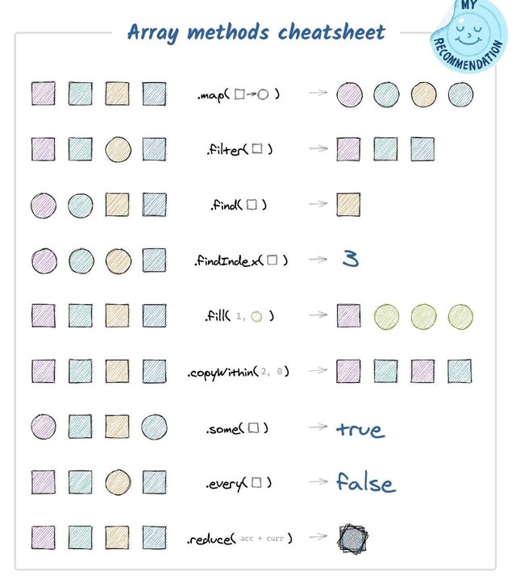

Définir une variable JavaScript avec le mot clé let
-------------------------
Depuis Juin 2015 et l’arrivée de la mise-à-jour ES6, on utilise donc plutôt le mot clé let pour définir les variables en JavaScript.
-------

Déclaration d’une variable avec let
La déclaration fonctionne comme avec var :

let ma_variable = "ma valeur";
console.log(ma_variable); // ma valeur
Il y a toutefois 2 différences majeures : la portée, et la redéfinition. Voyons cela :

Redéfinir une variable avec let
Avec let, il est possible d’assigner une nouvelle valeur à une variable plus loin dans le code. En revanche, il est impossible de la re-déclarer. On évite ainsi le problème d’écrasement de variable qu’on avait avec var.

Exemple :

let ma_variable = 10;
console.log(ma_variable); // 10
ma_variable = true; // true
let ma_variable = "Je suis freelance"; // Uncaught SyntaxError: Identifier 'ma_variable' has already been declared

-------------------------------------

Le DOM HTML (Document Object Model)
---
Lorsqu'une page Web est chargée, le navigateur crée un Document Object Model de la page.

Le modèle HTML DOM est construit comme un arbre d' objets :

L'arbre des objets HTML DOM (Document Object Model)

Avec le modèle objet, JavaScript obtient toute la puissance dont il a besoin pour créer du HTML dynamique :

JavaScript peut modifier tous les éléments HTML de la page
JavaScript peut modifier tous les attributs HTML de la page
JavaScript peut modifier tous les styles CSS de la page
JavaScript peut supprimer les éléments et attributs HTML existants
JavaScript peut ajouter de nouveaux éléments et attributs HTML
JavaScript peut réagir à tous les événements HTML existants dans la page
JavaScript peut créer de nouveaux événements HTML dans la page

--------------

document.QuerySelectorAll.row <-------- récup tous les CSS ".row" pour une div ou "#row" pour une classe
--------------
ne jamains utiliser un éléments du DOM sans a voir fait son querySelector
----------

document.querySelector"li:nth-child(4)" <------------- va chercher
----------
Aprés le querySelector, toujours pensé à boucler (for)
------
exemple:
---
let h2 = document.querySelectorAll ("li:nth-child(2)); <------------ va chercher toutes les  

for(let h2){

h2.style.color = "red"} <------------ colore tous les h2 en rouge

------------

           "defer"  === différé cet élément du script apré la fin du HTML

trés important pour exécuté le JS dans le bon ordre !
--
écouteur d'événements à placer au début du doc HTML = window.addEventListener("DOMContentLoaded")
-----------------

DOMContentLoaded <----------- document totalement chargé le JS et le CSS
-------

https://developer.mozilla.org/en-US/docs/Web/API/Document/DOMContentLoaded_event
-------
events JS
----
L'utilisateur clique avec la souris sur un certain élément ou en place le curseur sur un certain élément.
L'utilisateur appuie sur une touche du clavier.
L'utilisateur redimensionne ou ferme la fenêtre du navigateur.
Une page web finissant de se charger.
Un formulaire en cours de soumission
Une vidéo en cours de lecture, en pause ou en fin de lecture.
Une erreur qui survient.

------------------------

.map =La méthode map() crée un nouveau tableau avec les résultats de l'appel d'une fonction fournie sur chaque élément du tableau appelant.
La fonction Array.map permet de d'appliquer une fonction sur chaque élément d'un tableau et retourne un tableau de résultats.
---------------

----

.filter=La filter()méthode des Arrayinstances crée une copie superficielle d'une partie d'un tableau donné, filtrée uniquement sur les éléments du tableau donné qui réussissent le test implémenté par la fonction fournie.
-------------

-------

.join = La méthode join() crée et renvoie une nouvelle chaîne de caractères en concaténant tous les éléments d'un tableau (ou d'un objet semblable à un tableau). La concaténation utilise la virgule ou une autre chaîne, fournie en argument, comme séparateur.
----------

----

.sort = La méthode sort() trie les éléments d'un tableau, dans ce même tableau, et renvoie le tableau. Par défaut, le tri s'effectue sur les éléments du tableau convertis en chaînes de caractères et triées selon les valeurs des unités de code UTF-16 des caractères
--------
-----------
.localCompare = La localeCompare()méthode des Stringvaleurs renvoie un nombre indiquant si cette chaîne vient avant, après ou est identique à la chaîne donnée dans l'ordre de tri. Dans les implémentations avec prise en charge Intl.Collatorde l'API , cette méthode appelle simplement Intl.Collator.
Lors de la comparaison d'un grand nombre de chaînes, comme lors du tri de grands tableaux, il est préférable de créer un Intl.Collatorobjet et d'utiliser la fonction fournie par sa compare()méthode.
-------------------
 ----------
.startsWith()
La méthode startsWith() renvoie un booléen indiquant si la chaine de caractères commence par la deuxième chaine de caractères fournie en argument.
------------
------------
La concaténation en JavaScript:
-----
Concaténer signifie littéralement « mettre bout à bout ». La concaténation est un mot généralement utilisé pour désigner le fait de rassembler deux chaines de caractères pour en former une nouvelle.
----------

En JavaScript, l’opérateur de concaténation est le signe +. Faites bien attention ici : lorsque le signe + est utilisé avec deux nombres, il sert à les additionner. Lorsqu’il est utilisé avec autre chose que deux nombres, il sert d’opérateur de concaténation.

La concaténation va nous permettre de mettre bout-à-bout une chaine de caractères et la valeur d’une variable par exemple. Sans opérateur de concaténation, on ne peut pas en effet utiliser une chaine de caractères et une variable côté à côté car le JavaScript ne saurait pas reconnaitre les différents éléments.

Notez une chose intéressante relative à la concaténation en JavaScript ici : si on utilise l’opérateur + pour concaténer une chaine de caractères puis un nombre, alors le JavaScript va considérer le nombre comme une chaine de caractères.

------------
Fonctions fléchées "=>"
-----
Une expression de fonction fléchée (arrow function en anglais) permet d'avoir une syntaxe plus courte que les expressions de fonction et ne possède pas ses propres valeurs pour this, arguments, super, ou new.target. Les fonctions fléchées sont souvent anonymes et ne sont pas destinées à être utilisées pour déclarer des méthodes.
const materials = ['Hydrogen', 'Helium', 'Lithium', 'Beryllium'];

exemple:
-

console.log(materials.map((material) => material.length));
// Expected output: Array [8, 6, 7, 9]

-----------
.find:
----
La méthode find() renvoie la valeur du premier élément trouvé dans le tableau qui respecte la condition donnée par la fonction de test passée en argument. Sinon, la valeur undefined est renvoyée.

---

 // Vanilla JavaScript = codage natif en JavaScript qui permet de rester plusfacilement à jour avec les dernières technologies
"addeventlistener" est une méthode native de JavaScript qui permet d'attacher un événement à'
// JQuery = bibliothèque JavaScript qui facilite la manipulation du DOM et le développe
---

messages possible dans la console ,La console permet d'afficher quatre types de messages différents. Messages d'erreurs survenant dans JavaScript, le CSS, le XML, le réseau et la trace du log
---

---

Liste des différents selécteurs en JS:
-------

La méthode getElementById()
-------
La méthode getElementById() sélectionne un élément par la valeur de son attribut id. Etant donné que le duo id="valeur" est unique dans une page, le JavaScript peut agir sur un endroit précis sans risque de confusion.

Syntaxe
document.getElementById("nom")...

La méthode getElementsByTagName()
---
sélectionne un ou plus éléments grâce au nom de la balise. Notez le "s" à Elements, car les balises peuvent être évidemment multiples dans une page. Cette méthode génère une liste de balises qui se gère comme une variable de type tableau. Pour colorer le texte du premier élément 
, on mentionne l'indice [0] :

La méthode getElementsByClassName()
---
De la même manière, on peut sélectionner une ou plusieurs classes avec la méthode getElementsByClassName. Là encore, cette méthode se gère à la manière d'un tableau.
Le code ci-dessous va colorer en rouge tous les éléments 
 qui ont la classe "texte" :

La méthode querySelector() 
----
utilise un sélecteur CSS, ce qui est très pratique quand vous connaissez le langage CSS. S'il y a des éléments multiples, elle sélectionnera le premier.

document.querySelector("p").style.color = "red";

La méthode querySelectorAll() 
---------
sélectionne plusieurs éléments en utilisant des sélecteurs CSS. Cette méthode génère une nodelist qui se gère comme une variable de type tableau. Si l'on souhaite colorer le troisième élément 
, on écrit ceci :

document.querySelectorAll("p")[2].style.color = "red";

-------------

/*
//Cibler un élément
footer {}

//Cibler un id
#my-id {}

//Cibler une classe
.my-class {}

//Cibler les p dans la balise footer
footer p { color: red;}

footer .my-class span {}

*/

-------
innerHTML += "text" ---> rajoute le texte et ne l'écrase pas
-
innerHTML = "text" -----> écrase le texte
---

En HTML, innerHTML, innerText et textContent sont des propriétés du DOM (Document Object Model). Ils permettent de lire et de mettre à jour le contenu des éléments HTML.

Mais ils ont des comportements différents en termes de contenu qu’ils incluent et de la façon dont ils gèrent le balisage HTML.

À la fin de cet article, vous saurez les différences entre ces trois propriétés et quand vous devriez chacune.

Qu’est-ce que la propriété innerHTML?
-
Lorsque vous utilisez la propriété innerHTML, elle lit à la fois le balisage HTML et le contenu texte de l’élément. Cela signifie que lorsque vous l’utilisez pour définir le contenu des éléments, vous pouvez inclure des balises HTML et le navigateur les affichera correctement.

Mais soyez prudent si vous insérez du contenu provenant de la saisie d’un utilisateur ou de toute source non fiable avec innerHTML. Les attaquants peuvent utiliser la balise HTML Plus d’informations à ce sujet plus loin dans cet article.

Qu’est-ce que la propriété innerText?
-------
Cette propriété se concentre sur le contenu du texte rendu. Lorsque vous utilisez innerText pour lire le contenu d’un élément, il renvoie le texte tel qu’il apparaît à l’écran. Il ignore les balises HTML. Et il n’inclut pas non plus le texte qui est masqué avec les styles CSS.

Lorsque vous devez tenir compte des styles, vous devriez envisager d’utiliser innerText. Modifier l’intérieurtexte d’un élément signifie que le navigateur peut devoir ajuster la mise en page pour tenir compte des changements de taille du texte, ce qui peut avoir des répercussions sur les performances.

Qu’est-ce que la propriété textContent?
----------
La propriété textContent ignore également toutes les balises HTML et renvoie uniquement le texte. Whiles innerText lit le texte tel qu’il est rendu sur sc

innerHTML =
 MARCHE TOUJOURS
-------