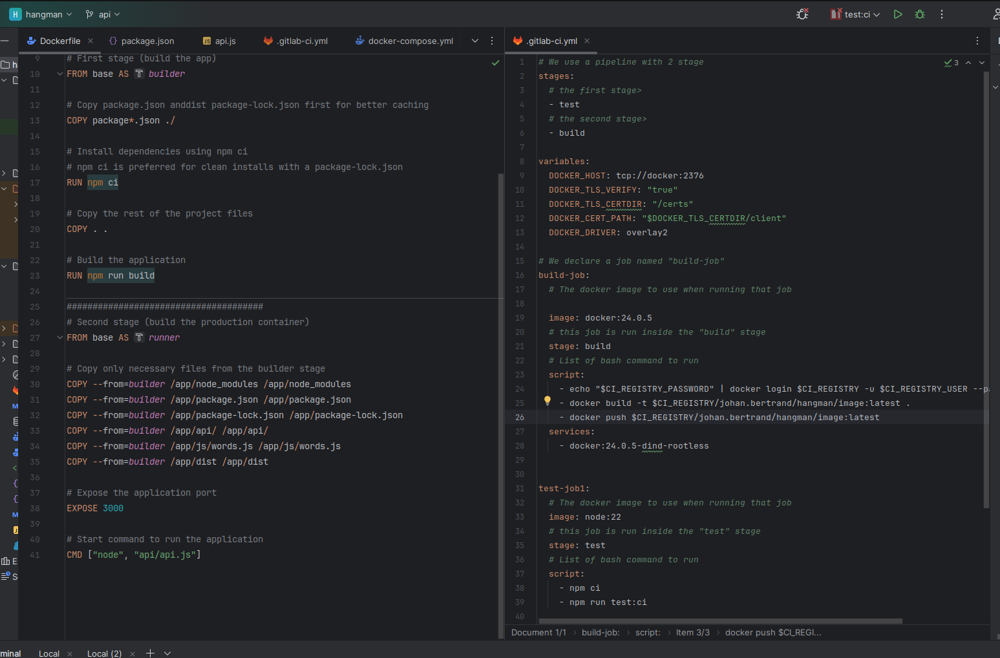
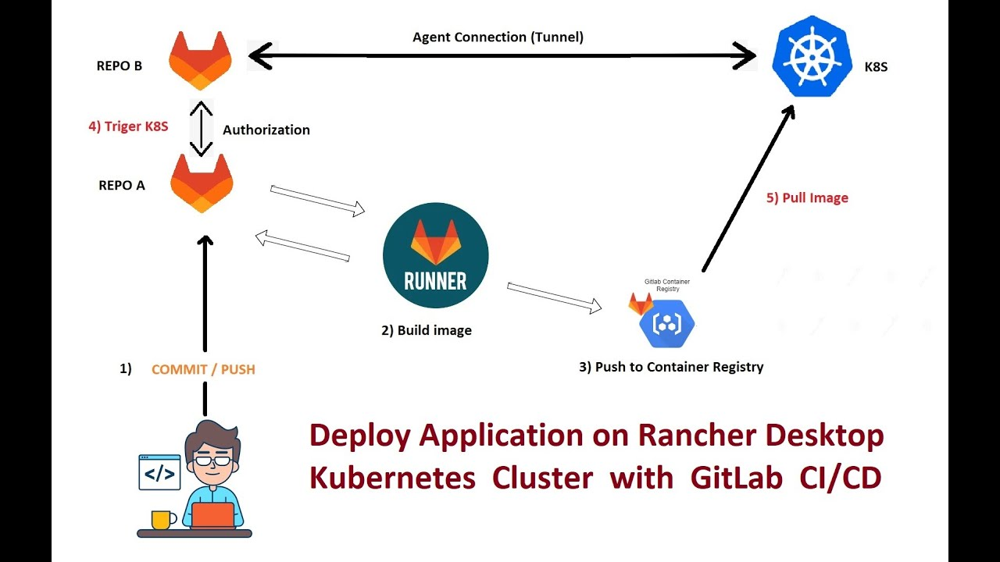
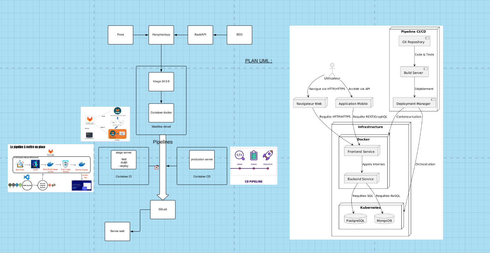

Docker : les concepts de base

Docker repose sur plusieurs concepts clés qui permettent de comprendre son fonctionnement et son utilité. Voici les concepts de base associés à Docker :

Image : Une image Docker est un modèle immuable utilisé pour créer un conteneur. Elle contient le code source de l’application, les bibliothèques, les dépendances et autres fichiers nécessaires à l’exécution de l’application.
---------

Dockerfile : C’est un fichier de script qui contient les instructions pour construire une image Docker.

Conteneur : Un conteneur est une instance exécutable d’une image Docker. Il s’agit d’une encapsulation légère d’une application et de son environnement d’exécution, fonctionnant de manière isolée sur le système hôte.
-

Registry : Zone de stockage pour les images Docker. Il peut être public ou privé (pour une utilisation interne en entreprise par exemple). Docker Hub est un service cloud public pour partager et stocker des images Docker. C’est comme un “GitHub” pour les images Docker, où les développeurs peuvent push ou pull des images.

Volume : Les volumes sont utilisés pour persister les données et partager des fichiers entre le conteneur et l’hôte. Ils sont essentiels pour éviter la perte de données lorsque les conteneurs sont arrêtés ou supprimés.

Réseau Docker : Docker possède sa propre gestion du réseau, permettant aux conteneurs de communiquer entre eux et avec des ressources extérieures. Il offre plusieurs modes réseau comme “bridge”,“host” et”overlay”

Docker Compose : C’est un outil pour définir et gérer des applications multi-conteneurs. Avec Docker Compose, on peut définir une application à l’aide de plusieurs conteneurs dans un seul fichier, puis démarrer ces conteneurs simultanément avec une seule commande. Par exemple, vous voulez déployer une application PHP qui utilise une base de données MySQL. Vous allez écrire un fichier docker-compose qui va décrire la configuration du conteneur pour PHP et le conteneur MySQL.
--------

Cela va éviter de lancer les commandes à la main et permettre d’avoir un suivi dans Git.

---------------

Docker est un outil qui peut empaqueter une appllication et ses dépendances dans un conteneur virtuel, qui pourra être exécuté sur n'importe quel serveur Linux
--------

clé publique = crypter la requête
----

clé privé = décrypter la requête
-------------

déploiement d'un site sans conteneurisation=
---

NGINX = server
   |
   |
PHP-FPM = traducteur de requête http PHP en HTML,JS,ect...
   |
   |
code source = application/site

instance de l'image qui est un conteneur = registery(DockerHub) 

docker-compose up --build = commande
-
build les docker file des framework front et back (vue, laravel) avec leurs dockerfiles respectifs et le dockercompose.yml
---

-----------------

Dockerfile :
-
Un Dockerfile spécifie deux choses pour une nouvelle image Docker : L'image de base à partir de laquelle la nouvelle image est dérivée. Ceci ancre la nouvelle image dans l'arbre généalogique de l'écosystème Docker. Un certain nombre de changements spécifiques qui distinguent la nouvelle image de l'image de base.
-
-----------------
docker-compose.yml :
-
yml est un fichier de configuration pour Docker Compose. Il permet de déployer, de combiner et de configurer plusieurs conteneurs Docker en même temps. La « règle » Docker consiste à externaliser chaque processus vers son propre conteneur Docker. Prenons par exemple une application Web simple : vous avez besoin d'un serveur, d'une base de données et de PHP
-
---------------
Un GitLab Pipeline
-
est une suite d’étapes automatisées définies dans un fichier .gitlab-ci.yml. Il permet d’automatiser l’intégration continue (CI) et la livraison continue (CD) de vos projets. Un pipeline peut inclure des tâches telles que la compilation du code, l’exécution de tests, le déploiement ou la publication d’artefacts, comme des images Docker.
-
Les pipelines sont exécutés à chaque modification du code, assurant ainsi une vérification continue de la qualité et de la stabilité de l’application tout au long du cycle de développement.
-
---------------

Docker Compose est un outil puissant permettant de définir et de gérer des applications conteneurisées multi-services en utilisant un simple fichier YAML. Il simplifie l’orchestration des conteneurs Docker en automatisant leur création, leur configuration et leur mise en réseau. Grâce à Docker Compose, il est possible de déployer et de maintenir des environnements complexes avec un minimum d’effort, tout en garantissant la reproductibilité et la portabilité des configurations.
-
-------------------

Voici une liste complète des étapes pour configurer un pipeline CI/CD sur GitLab :

1. Préparation de l’environnement
   Créer ou choisir un projet sur GitLab :

Assurez-vous que le projet est configuré et dispose d’un dépôt Git.
Définir les objectifs du pipeline CI/CD :

Build (compilation).
Tests (unitaires, intégration).
Analyse (linting, analyse de code).
Déploiement (staging, production).
Installer un GitLab Runner (si nécessaire) :

Choisir entre un runner partagé (offert par GitLab) ou un runner spécifique.
Configurer un runner sur votre serveur ou machine.
2. Création du fichier .gitlab-ci.yml
   Créer le fichier .gitlab-ci.yml à la racine du projet :

Ce fichier décrit toutes les étapes de votre pipeline.
Définir les jobs et stages :

stages: Définit les étapes globales (build, test, deploy).
jobs: Actions spécifiques pour chaque étape.
Exemple minimal :
yaml
Copier le code
stages:
- build
- test
- deploy

build_job:
stage: build
script:
- echo "Building the project..."
- make build

test_job:
stage: test
script:
- echo "Running tests..."
- make test

deploy_job:
stage: deploy
script:
- echo "Deploying to production..."
- make deploy
only:
- main
3. Configurer les variables d’environnement
   Aller dans les paramètres GitLab :

Settings > CI/CD > Variables.
Ajouter les clés API, tokens, ou autres secrets nécessaires (e.g., API_KEY, DEPLOY_TOKEN).
Utilisation dans .gitlab-ci.yml :

yaml
Copier le code
script:
- echo $API_KEY
4. Étape de Build
   Installer les dépendances nécessaires (npm, maven, composer, etc.).
   Compiler le projet si nécessaire.
   Créer des artefacts (fichiers générés pour usage ultérieur).
   yaml
   Copier le code
   build_job:
   stage: build
   script:
   - npm install
   - npm run build
     artifacts:
     paths:
      - dist/
5. Étape de Test
   Ajouter des tests unitaires et d’intégration.
   Inclure des outils d’analyse statique (ESLint, PHPStan, etc.).
   yaml
   Copier le code
   test_job:
   stage: test
   script:
   - npm run test
6. Étape de Déploiement
   Déploiement staging ou production :

Script pour copier les fichiers sur un serveur (via SCP, rsync, etc.).
Déployer sur des services cloud (AWS, GCP, Azure).
yaml
Copier le code
deploy_job:
stage: deploy
script:
- scp -r dist/ user@server:/path/to/deploy
only:
- main
Utiliser des services spécifiques (e.g., Kubernetes, Docker Registry).

7. Ajouter des notifications (optionnel)
   Configurer des notifications pour recevoir des alertes en cas de succès ou d’échec.
   yaml
   Copier le code
   notifications_job:
   stage: notify
   script:
   - curl -X POST -H "Content-Type: application/json" -d '{"text": "Build successful"}' https://hooks.slack.com/services/your-webhook
8. Vérifier et lancer le pipeline
   Commit et push le fichier .gitlab-ci.yml :
   GitLab détectera automatiquement le fichier et déclenchera le pipeline.
   Vérifier l’exécution dans l’onglet CI/CD :
   Allez dans CI/CD > Pipelines pour voir les logs et résultats.
9. Maintenance et optimisation
   Ajouter des pipelines dynamiques :

Utiliser des stratégies when, rules, ou if pour déclencher des jobs conditionnels.
Utiliser des cache pour accélérer les jobs répétitifs :

yaml :

cache:
paths:
- node_modules/
Surveiller les performances des pipelines :

Identifier et réduire les étapes lentes.
Ajouter des exécutions parallèles pour accélérer.

--------------------

      .gitlab-ci.yml : fichier pour pousser et faire les tests, crée le pipeline (CI)
----------------

      https://gitlab.minimmo.fr/johan.bertrand = pour l'intégration continue

-------------------------

registery gitLab = repos gitHub
-
---------------

fichier

---------

docker build -t registry.minimmo.fr/johan.bertrand/hangman . 
-
docker push registry.minimmo.fr/johan.bertrand/hangman     
-
docker login registry.gitlab.com  
-
docker-compose up -d
-
--------
chmod go-rwx supprime les autorisations de lecture/écriture/exécution du groupe et des autres, mais préserve les autorisations dont disposait le propriétaire.
-

-------------

