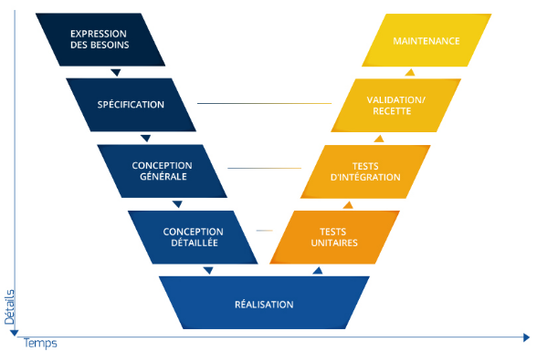

------------
Le triangle d'or
-

--------------

CYCLE EN V= 
-

------

CYCLE PDCA=
-

S.M.A.R.T = spécifique, mesurable, atteignable, réaliste et temporellement défini.
--
Les objectifs SMART doivent être fixés après avoir bien défini la portée du projet. Sans cela, ils seront difficilement réalisables 
-
Les objectifs SMART doivent être fixés après avoir bien défini la portée du projet. Sans cela, ils seront difficilement réalisables 
-
Que sont les objectifs SMART ?
-
Les objectifs SMART permettent de définir des buts et des KPI d'une façon précise et facile à communiquer. L'acronyme SMART est décrit pour la première fois en 1981 par l'auteur George T. Doran, puis développé ensuite par le professeur Robert S. Ruben. Il signifie :
-

Spécifique
-
Mesurable
-
Acceptable
-
Réaliste
-
Temporellement défini
------------------
Si vos objectifs ne sont pas mesurables, il ne sert à rien d’avoir des objectifs ! 
-
Au moment de créer votre objectif SMART, essayez de répondre à des questions du type :
-
Quelles sont les étapes concrètes de notre projet ?
-
Qui sont les acteurs nécessaires à sa réalisation ?
-
Où devons-nous concentrer nos efforts ?
-
Quel est l'intérêt pour notre stratégie à long terme ?
-
Quelle est la priorité de cet objectif par rapport aux autres ?
-
De quelles données avons-nous besoin ?
-
Où seront conservées nos données et comment y aurons-nous accès ?
-
Nos données sont-elles fiables et vérifiables ?
-
Qu'est-ce qu'un jalon raisonnable ?
-
Combien faut-il de jalons ?
-
Comment saurons-nous que nous avons atteint notre objectif ?
-
Exemple :
-
« Objectif : Je souhaite trouver l’amour et fonder une famille. Formulation : Avant mes 40 ans, je souhaite rencontrer une personne qui me convienne sur les sites de rencontre. »
-
La méthode SMART nous permet de définir des objectifs plus précis et plus clairs, mais elle n’est pas absolue. Il ne s’agit pas de l’appliquer à la lettre !
-

Pourquoi SMART?=
1. Pour mettre en place un plan d'action marketing
   Plus l’objectif est clair, plus les actions à réaliser sont également claires.
2. Pour atteindre ses objectifs marketing
   Grâce à des objectifs précis, vous pourrez trouver la meilleure stratégie plus facilement. 
3.  Pour éviter tous les facteurs qui pourraient nuire à l’atteinte de ces objectifs

-----------

Mise en place d'une méthode smart : les avantages pour l’entreprise
   Management des collaborateurs et pilotage de leurs efforts
   Amélioration de la communication entre manager et managé
   Alignement de la stratégie rendant complémentaires et cohérentes les décisions et actions des collaborateurs
   Amélioration de la performance de l’entreprise
   Utilisation à bon escient des ressources de l’entreprise
   Mesure de la performance de l’entreprise et du niveau de réussite du projet
------
Mise en place d'un projet smart : les avantages pour l’employé
   Parfaite connaissance des tâches, économisant du temps et de l’argent
   Ressources du collaborateur focalisées sur l’atteinte des objectifs, évitant la dispersion des efforts
   Un collaborateur impliqué, fier de ses résultats et récompensé
   Sentiments de satisfaction et de réalisation personnelle à l’atteinte de l’objectif

-----------

Exemple d'application de la méthode SMART
-
Description : L’amélioration de l’expérience client sur les appareils mobiles est une initiative majeure pour mon entreprise cette année. C’est pourquoi nous allons créer une application mobile. D’ici la fin de l’année fiscale, il devrait y avoir 50 000 installations de l’application mobile que nous développons et elle devrait produire un taux de conversion de 5 %.
-
Nous construirons l’application mobile en interne et la lancerons d’ici la fin du deuxième trimestre avec une campagne de marketing liée aux applications qui se poursuivra jusqu’à la fin de l’année.
-
Échéances : Lancement d’une application mobile à la fin du deuxième trimestre.
-
Date limite : Fin de l’exercice fiscale.
-

---------

-
Exemple 1 - Augmentation des ventes du nouveau produit
-
Objectif SMART : augmenter les ventes en quantité de notre nouveau produit de 20 % d'ici la fin de l'année.
-
S - L'objectif est clairement Spécifié : augmentation des ventes en quantité.
-
M - il est Mesurable : ce sont des données de base disponibles dans le Système d'Information provenant de l'ERP.
-
A - Atteignable, 20%, c'est un chiffre ambitieux, mais cohérent avec les KPI ( indicateurs de performance ), les précédents lancements de ce type de produit, et les moyens qui seront dégagés.
-
R - Réaliste, pertinent. Il fait partie des objectifs commerciaux prioritaires, car le nouveau produit présente un véritable potentiel. A coordonner avec les actions de prospection pour trouver de nouveaux clients.
-
T - Objectif temporel : résultat attendu en fin d'année
-
-----------
Exemple 2 - Amélioration de la satisfaction des employés
-
Objectif  SMART  : augmenter l'indice de satisfaction des employés pour passer de 80 à 90 % sur l'année 2024.
-
S - L'objectif est bien Spécifié : amélioration de l'indice de satisfaction des employés. C'est une formulation claire.
-
M - Les résultats sont mesurables : les évaluations régulières de la satisfaction des employés sont réalisées.
-
A - Atteignable : passer de 80 à 90 % est une progression cohérente avec les résultats passés et les efforts de l'entreprise prévus pour améliorer les conditions de travail.
-
R - L'objectif est Réaliste : la direction s'engage activement à poursuivre les initiatives pour assurer le bien-être des employés.
-
-
T - Échéance précise : appréciation des résultats fin 2024
-
---------------

Le diagramme de Gantt = un diagramme de Gantt répertorie toutes les tâches à accomplir pour mener le projet à bien, et indique la date à laquelle ces tâches doivent être effectuées (le planning).
-
La colonne de gauche du diagramme énumère toutes les tâches à effectuer, tandis que la ligne d'en-tête représente les unités de temps les plus adaptées au projet (jours, semaines, mois etc.). Chaque tâche est matérialisée par une barre horizontale, dont la position et la longueur représentent la date de début, la durée et la date de fin.
-
-----------

PERT, acronyme anglais de Program Evaluation Review Technique, signifie « technique d'évaluation et d'examen de programmes ». Un diagramme de PERT est un outil servant à analyser les différentes tâches qui entrent dans l'exécution d'un projet.
-

Le chemin critique (en anglais, Critical Path Method ou CPM) est une technique qui permet d'identifier les tâches nécessaires à l'achèvement d'un projet. En gestion de projet, le chemin critique représente la plus longue séquence d'activités à réaliser dans les temps, afin de boucler l'ensemble du projet
-
1) Découper le projet en tâches
-
2) Estimer chaque tâcches
-
3) Créer le réseau de PERT
-
4) Identifier le chemin critique
--------

Un diagramme de PERT est axé sur la visualisation des dépendances entre les tâches d'un projet et l'identification du chemin critique.
-
Un diagramme de Gantt, quant à lui, met l'accent sur la planification temporelle, montrant quand chaque tâche doit commencer et se terminer.
-
----------------------
Qu'elle différnce entre les 2?
-

Le diagramme de Pert met en évidence les interdépendances
-

les diagrammes de Gantt indiquent les tâches et la chronologie sous forme de barres
-
------------------
-Utilisez un diagramme PERT lorsque vous devez :
----------------
-Prévoir le temps nécessaire pour mener à bien le projet
-
-Déterminer le chemin critique pour respecter vos échéances
-
-Planifier des projets de grande envergure ou plus complexes
-
-Afficher l’interdépendance des tâches
-
---------------------------
-Utilisez un diagramme de Gantt lorsque vous devez :
-
-Prévoir le temps nécessaire pour accomplir chaque tâche
-
-Communiquer clairement les responsabilités liées aux tâches
-
-Communiquer l’avancement du projet
-

------------

scénario gestion de tâches
-
cycles itératif

--------

scénario construction d'un pont
-
cycles en cascades

--------

scénario GRH
-
cycls en V

-------

scénario nourriture
-
méthodes agiles

