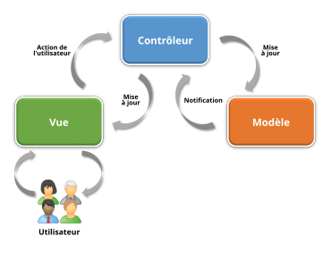
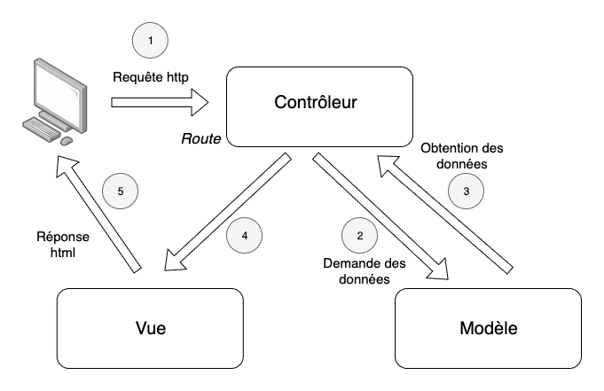
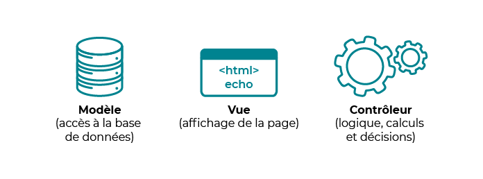
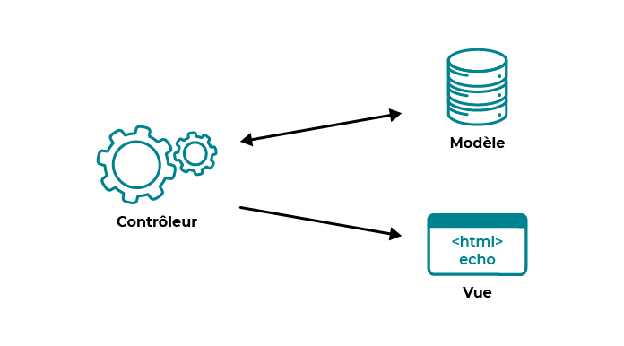
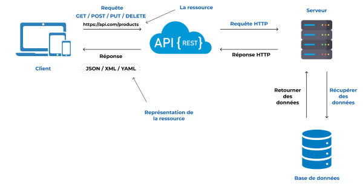

POST
PUT= MODIFIER
DELETE
POST
PUT= MODIFIER
DELETE
A.P.I =
--------

Aplicaton Programming Interface
Communication via internet

Mise a jour dynamique
----------

API REST=
INterface uniforme en language commun, les ressources sont identifier par une adresse web
L'API REST est un style architectural qui permet aux logiciels de communiquer entre eux, quels que soient les systèmes d'exploitation. Les API REST fonctionnent sur la base d'une relation client/serveur en fournissant une interface uniforme.
En REST ,ont ne choisit pas les champs qu'on récup

REQUETE=
GET 
POST
PUT= MODIFIER
DELETE

--------------------------

------------

MVC= modéle-vue-controler 

Modéle= Design Patern
(plan du site)
-------------

----------------
Un modèle (Model) contient les données à afficher ;

---------------

Une vue (View)
--------------
 contient la présentation de l'interface graphique ;
Un contrôleur (Controller) contient la logique concernant les actions effectuées par l'utilisateur

---------
Modèle
---------
Élément qui contient les données ainsi que de la logique en rapport avec les données : 
validation, lecture et enregistrement4.
 Il peut, dans sa forme la plus simple, contenir uniquement une simple valeur, ou une structure de données plus complexe5.
 Le modèle représente l'univers dans lequel s'inscrit l'application3. Par exemple pour une application de banque, le modèle représente des comptes, des clients, ainsi que les opérations telles que dépôt et retraits, et vérifie que les retraits ne dépassent pas la limite de crédit3.

 ------
Vue
------
Partie visible d'une interface graphique4. La vue se sert du modèle, et peut être un diagramme, un formulaire, des boutons, etc4. Une vue contient des éléments visuels ainsi que la logique nécessaire pour afficher les données provenant du modèle4. Dans une application de bureau classique, la vue obtient les données nécessaires à la présentation du modèle en posant des questions. Elle peut également mettre à jour le modèle en envoyant des messages appropriés5. Dans une application web une vue contient des balises HTML3.

----------
Contrôleur
----------
Module qui traite les actions de l'utilisateur, modifie les données du modèle et de la vue4.

Endpoint= Base de données 
= URL
---

-----

CRUD=
--------
CREATE /REAL /UPDATE /DELETE

MVC signifie “Modèle, Vue, Contrôleur”, c’est un patron de conception concernant l'agencement du code. Le code est segmenté selon ces trois sections : le modèle contient le code qui gère la logique métier, la vue celui qui gère l'affichage, et le contrôleur gère le lien avec l'utilisateur.
-----------

MVC signifie “Modèle, Vue, Contrôleur”, c’est un patron de conception concernant l'agencement du code. Le code est segmenté selon ces trois sections : le modèle contient le code qui gère la logique métier, la vue celui qui gère l'affichage, et le contrôleur gère le lien avec l'utilisateur.

Router = n'est pas un controller
avoir une URL propre, c'est un chemin pour aller chercher les codes paramétres ect
le modéle et la vue ne communique jamais ensemble
-

--------------

Composer dump-autoload
= recharger l'autoload

--------------

200 Ok
----
Le code HTTP 200 est bon signe. Il indique que la requête a été traitée avec succès. Le serveur envoie alors la réponse « 200 OK ». Ce code HTTP intervenant quand tout se passe bien, il n’y a pas de raison que vous le rencontriez. Votre navigateur web l'interprète, mais ne vous l’affiche pas.

301 Redirect
--------
Ce code HTTP est particulièrement utile pour le SEO. En effet, lorsque les robots des moteurs de recherche parcourent votre site, ils font de nombreuses requêtes au serveur et interprètent les codes HTTP. Dans le cas où ils parcourent une page dont l’adresse a changé, le serveur va renvoyer le code 301 afin d’informer que le contenu demandé est disponible, mais a changé d’adresse. De cette façon, les moteurs de recherche peuvent indexer la page de votre site avec la bonne adresse URL. On parle alors de redirection 301. Ce type de redirection permanente peut par exemple être utilisée dans le cas où vous vendez un article qui ne se fait plus, mais est remplacé par un plus récent. Par exemple, vous vendiez une GoPro 8, qui n’est plus commercialisée, vous allez alors rediriger l’url de la fiche produit vers la fiche produit de la GoPro 9.

presentation

302 Found
-------
Là encore, le code 302 est lié aux redirections. Il indique que le serveur à bien reçu la requête du client, qu’il a trouvé la page à transmettre, mais que celle-ci est disponible à un autre endroit. Contrairement au code 301 qui indique un état permanent, ici le code suggère un état temporaire, comme dans le cas où vous seriez en train d’opérer une migration de votre site par exemple. Vous allez ainsi renvoyer temporairement vos visiteurs vers une nouvelle page ou un nouveau site, le temps de l’opération.

307 Temporary Redirect
-------
Ce code HTTP est aujourd’hui de plus en plus utilisé et remplace souvent le code 302. Il signale exactement la même chose : une redirection temporaire. Cela peut par exemple être utilisé sur votre site si vous avez des liens HTTP et HTTPS. 

403 Forbidden
-------
Ce code est renvoyé par le serveur lorsqu’un utilisateur envoie une requête pour accéder à quelque chose qui est protégé, sans se connecter. Cela peut-être par exemple un produit digital, comme un e-book en PDF. Pour résoudre ce problème, il suffit bien souvent à l’utilisateur de se connecter pour être identifié et pouvoir accéder au e-book… sauf bien sûr s’il ne l’a pas acheté, mais a obtenu l’URL de téléchargement par un tiers.

404 Not Found
------------
Est-ce vraiment utile de vous présenter ce code-ci ? Oui ?! Et bien ce code signale au client web que la page demandée est introuvable. Cela signifie la plupart du temps que l’URL de la page a changé et qu’aucune redirection n’a été mise en place. Cela arrive par exemple si vous avez supprimé un produit, renommé une catégorie ou dépublié une landing page. Cette erreur est pénalisante pour votre référencement, car vous avez une page indexée qui n’existe plus. Pour repérer les URLs de votre boutique en ligne qui renvoient une erreur 404, vous pouvez utiliser Google Search Consol. Une fois les pages disparues identifiées, mettez en place sur votre boutique des redirections 301 vers la nouvelle URL ou une page dans la même thématique (ex. catégorie de produit).

------------------------------

REST
-
 est l'acronyme de Representational State Transfer. Voici une explication plus détaillée de chaque terme :

Representational : Cela fait référence aux représentations des ressources que le client manipule. Les ressources sont accédées et représentées sous différentes formes, telles que JSON, XML, HTML, etc.

State : Cela concerne l'état de la ressource à un moment donné. Chaque représentation d'une ressource capture l'état actuel de cette ressource. Le client et le serveur n'ont pas besoin de conserver d'état au-delà de la durée d'une requête.

Transfer : Cela fait référence au transfert de données entre le client et le serveur. Les clients envoient des requêtes pour manipuler les ressources, et les serveurs répondent avec les représentations de ces ressources.

Ainsi, REST se concentre sur la gestion et la manipulation des ressources via des représentations transférées entre un client et un serveur, de manière sans état.

Client-Serveur :
---

Séparation entre le client (qui demande des ressources) et le serveur (qui fournit des ressources). Cela permet une indépendance des deux parties, facilitant la maintenance et l'évolution de chaque composant indépendamment.
Sans État (Stateless) :

Chaque requête du client au serveur doit contenir toutes les informations nécessaires pour comprendre et traiter la demande. Le serveur ne conserve aucune information sur l'état du client entre les requêtes. Cela améliore la scalabilité en simplifiant la gestion des sessions.
Cacheable :

Les réponses des serveurs doivent indiquer si elles peuvent être mises en cache ou non, et pour combien de temps. Cela améliore les performances en réduisant le nombre de requêtes répétitives au serveur.
Interface Uniforme :

Une interface 
------------
uniforme est fondamentale pour la simplicité et la compréhension du système. Elle repose sur quatre contraintes :
Identification des ressources : Les ressources (données) sont identifiées par des URI (Uniform Resource Identifier).
Manipulation des ressources via des représentations : Les clients manipulent les ressources à l'aide des représentations (par exemple, JSON, XML).
Messages auto-descriptifs : Chaque message contient suffisamment d'informations pour décrire comment le traiter.
Hypermedia as the Engine of Application State (HATEOAS) : Les clients interagissent avec l'application entièrement via les hyperliens fournis dynamiquement par les applications.

Système en couches :
----------

Une architecture REST peut être composée de plusieurs couches, chaque couche ayant une fonction spécifique. Par exemple, une couche pourrait gérer l'authentification, une autre pourrait gérer la mise en cache, etc. Cela permet de modulariser et d'isoler les préoccupations.
Code à la demande (facultatif) :

Les serveurs peuvent fournir du code exécutable au client (comme des scripts JavaScript). Cela permet d'étendre les fonctionnalités du client sans nécessiter de mises à jour du client lui-même.

-------------

