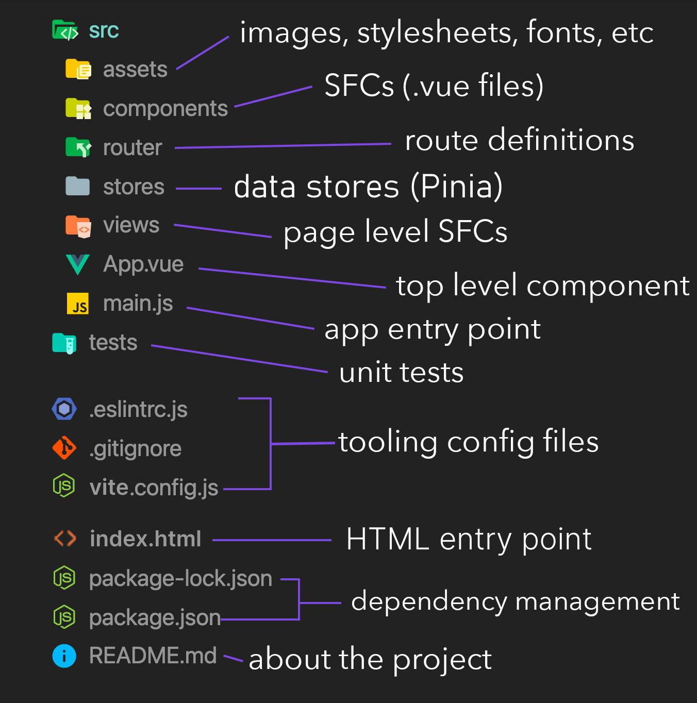

## this = this est un opérateur et comme tout opérateur, il retourne une valeur
## Lorsqu'une fonction est appelée comme méthode d'un objet, this correspondra à l'objet possédant la méthode qu'on appelle
## Import et export de modules=

Exporter des fonctionnalités
Pour commencer et afin d'utiliser les fonctionnalités d'un module, on devra les exporter. Pour cela, on utilisera l'instruction export.

---

## destructuring=

L'affectation par décomposition (destructuring en anglais) est une expression JavaScript qui permet d'extraire (unpack en anglais) des données d'un tableau ou d'un objet grâce à une syntaxe dont la forme ressemble à la structure du tableau ou de l'objet.

---

## promesse =

Une promesse est un objet renvoyé par une fonction asynchrone et qui représente l'état courant de l'opération.

---

## l'API fetch =

fetch est une façon très simple (beaucoup moins verbeuse que XMLHttpRequest) de faire des requêtes HTTP et permet d'améliorer la performance d'un site dans certains cas.

---

## Async/await

Il existe une syntaxe spéciale pour travailler avec les promesses d’une manière plus confortable, appelée “async/await”. Elle est étonnamment facile à comprendre et à utiliser.

## Le mot-clé async devant une fonction a deux effets:

Fait en sorte qu’elle retourne toujours une promesse.
Permet l’utilisation de await dans celle-ci.
Le mot-clé await devant une promesse fait en sorte que JavaScript attende jusqu’à ce que cette promesse se règle, puis:

Si c’est une erreur, l’exception est générée – comme si throw error était appelé à cet endroit précis.
Sinon, il renvoie le résultat.
Ensemble, ils fournissent un cadre idéal pour écrire du code asynchrone facile à lire et à écrire.

Avec async/await, nous avons rarement besoin d’écrire promise.then/catch, mais nous ne devons pas oublier qu’ils sont basés sur des promesses, parce que parfois (par exemple dans le scope le plus externe) nous devons utiliser ces méthodes. De plus, Promise.all est très utile lorsque l’on attend plusieurs tâches simultanément.

---

## Destructuration=

L'affectation par décomposition (destructuring en anglais) est une expression JavaScript qui permet d'extraire (unpack en anglais) des données d'un tableau ou d'un objet grâce à une syntaxe dont la forme ressemble à la structure du tableau ou de l'objet.

let a, b, rest;
[a, b] = [10, 20];

console.log(a);
// Expected output: 10

console.log(b);
// Expected output: 20

[a, b, ...rest] = [10, 20, 30, 40, 50];

console.log(rest);
// Expected output: Array [30, 40, 50]

## Ces expressions utilisant des littéraux pour les objets ou les tableaux permettent de créer simplement des données regroupées. Une fois créées, on peut les utiliser de n'importe quelle façon, y compris comme valeur renvoyée par une fonction.

## destructuration d'un tableau=

const toto = ["un", "deux", "trois"];

// sans utiliser la décomposition

const un = toto[0];
const deux = toto[1];
const trois = toto[2];

// en utilisant la décomposition

const [un, deux, trois] = toto;

---

## exemple de destructuration =

const user = {
firstName: "Johan",
lastName: "Bertrand"
}

const {firstName, lastName, age = 23 } = user
console.log(firstName)
console.log(lastName)
console.log(age)

const city = "Annecy"

const otherUser = {
firstName,
city
}

---

function addPerturbation(key, {
longitude, latitude, text: texte, startDate: dateDebut, endDate: dateFin,
type = 'default', heureDebut = '00:00', heureFin = '12:00'
} = {}) {
data[key] = {longitude, latitude, texte, dateDebut, dateFin, type, heureDebut, heureFin};
}

addPerturbation('1234',
{
longitude: 23.34,
latitude: 23.45,
text: "123",
startDate: "2021-01-02",
endDate: "2023-01-02"
});

addPerturbation('default');

console.log(data);

---

## promise=

Une promesse est un objet renvoyé par une fonction asynchrone et qui représente l'état courant de l'opération
L'objet Promise (pour « promesse ») est utilisé pour réaliser des traitements de façon asynchrone. 

Une promesse représente une valeur qui peut être disponible maintenant, dans le futur voire jamais.
-

Une Promise est dans un de ces états :

pending (en attente) : état initial, la promesse n'est ni tenue, ni rompue ;
fulfilled (tenue) : l'opération a réussi ;
rejected (rompue) : l'opération a échoué
---

exemple=
-

function wait(delay, myCallbackFunction){
setTimeout(() => {
console.log("dans ma fonction wait")

        const user = {
            firstName: "Alban"
        }

        myCallbackFunction(user, "oisdhfqshdfoiqldsf")
    }, delay)

}

console.log("afficher coucou chose après 3s")
wait(5000, (user, str) => {
console.log("coucou")
console.log(user)
console.log(str)
})

async function waitWithPromise(delay){
return new Promise((maFonctionQuandToutSePasseBien, reject) => {
setTimeout(() => {
console.log("after delay")

            const user = {
                firstName: "Alban"
            }

            reject("Mon serveur est down")
            //maFonctionQuandToutSePasseBien(user)
        }, delay)
    })

}

console.log("afficher coucou chose après 3s")
waitWithPromise(5000).then((user) => {
console.log("coucou")
console.log(user)
}).catch((e) => {
console.log("Ca a fail")
console.log(e)
}).finally(() => {
console.log("c'est fini")
})

try {
const user = await waitWithPromise(5000)
console.log("salut")
console.log(user)
} catch(e){
console.log("ça a pas marché")
}

const myUser = await waitWithPromise(5000).catch(e => console.log("ça a pas marché non plus"))

//  fonction qui prend un nombre indéfini de paramètre et les affiche dans la console
--
function display(...args) {
    for (const arg of args) {
        console.log(arg);
    }
}=>

------

Import/export=
---------------

import {fonction} from './fichier.js';
fonction();

export {fonction} from './fichier.js';

fonction de default = 1 seule par dossier
-------
// avec accolade
import{ default as nyan }  from './functions.js';
nyan();

=>
// sans acolade
import nyan from './fonction.js';
nyan();

-----

Promises=
---------

Une promesse est un objet (Promise) qui représente la complétion ou l'échec d'une opération asynchrone. La plupart du temps, on « consomme » des promesses et c'est donc ce que nous verrons dans la première partie de ce guide pour ensuite expliquer comment les créer.

En résumé, une promesse est un objet qui est renvoyé et auquel on attache des callbacks plutôt que de passer des callbacks à une fonction. Ainsi, au lieu d'avoir une fonction qui prend deux callbacks en arguments :

function faireQqc() {
  return new Promise((successCallback, failureCallback) => {
    console.log("C'est fait");
    // réussir une fois sur deux
    if (Math.random() > 0.5) {
      successCallback("Réussite");
    } else {
      failureCallback("Échec");
    }
  });
}

const promise = faireQqc();
promise.then(successCallback, failureCallback);

Cette dernière forme est ce qu'on appelle un appel de fonction asynchrone. Cette convention possède différents avantages dont le premier est le chaînage.
----------

-------------

Grâce à des fonctions plus modernes et aux promesses, on attache les callbacks aux promesses qui sont renvoyées. On peut ainsi construire une chaîne de promesses :

exemple=
--
faireQqc()
  .then(function (result) {
    return faireAutreChose(result);
  })
  .then(function (newResult) {
    return faireUnTroisiemeTruc(newResult);
  })
  .then(function (finalResult) {
    console.log("Résultat final : " + finalResult);
  })
  .catch(failureCallback);

-----------

Composition=
--
Promise.resolve() et Promise.reject() sont des méthodes qui permettent de créer des promesses déjà tenues ou rompues.

Promise.all() et Promise.race() sont deux outils de composition qui permettent de mener des opérations asynchrones en parallèle.

On peut lancer des opérations en parallèles et attendre qu'elles soient toutes finies de cette façon :

Promise.all([func1(), func2(), func3()]).then(
  ([resultat1, resultat2, resultat3]) => {
    /* où on utilise resultat1/2/3 */
  },
);

-----------

Une promesse
--
 est un objet JavaScript qui produira une valeur à un moment donné dans le futur. Cela s'applique généralement aux opérations asynchrones.

Dans les applications, les opérations asynchrones sont très fréquentes. Il peut s'agir de requêtes API, de traitements de données différés et bien plus encore.

Au lieu de devoir bloquer l'exécution du code jusqu'à ce que les données soient chargées, vous pouvez les définir comme des promesses, afin que l'exécution du code se poursuive avec d'autres parties du code. Et lorsque les promesses sont remplies, vous pouvez utiliser les données qu'elles contiennent.

Vous pouvez en apprendre davantage sur les promesses dans cet article simplifié .

Dans certains cas, une promesse est tenue, dans d'autres, elle échoue. Comment gérez-vous le résultat de chaque résultat ?

Pour le reste de cet article, nous allons comprendre les méthodes then, catchet finallydes promesses.

Les états des promesses en JavaScript
Une promesse a trois états :

en attente : la promesse est toujours en cours
accompli : la promesse est résolue avec succès et renvoie une valeur
rejeté : la promesse échoue avec une erreur
Les états accompli et rejeté ont un point commun : qu'une promesse soit accomplie ou rejetée, la promesse est réglée . Ainsi, un état réglé peut être soit une promesse accomplie, soit une promesse rejetée.

try...catch
---
L'instruction try...catch regroupe des instructions à exécuter et définit une réponse si l'une de ces instructions provoque une exception.

promise.then(value => {
 // use value for something
})

promise
  .then(value => {
    return value.anotherPromise()
  })
  .then(anotherValue => {
    // use this value
  })

  Vous pouvez utiliser la finallyméthode comme ceci :
  --------

let dataIsLoading = true;

promise
  .then(data => {
    // do something with data
  })
  .catch(error => {
   // do something with error
  })
  .finally(() => {
    dataIsLoading = false;
  })

catch = prendre
-----
fecth = récupérer

-----------------------

POUR RESUMER
----

async Function
-
Une fonction marquée avec le mot-clé async est une fonction asynchrone. Elle retourne automatiquement une promesse. Le mot-clé async permet d'utiliser await à l'intérieur de la fonction.

Syntaxe :

Ce que fait async :
------------

Retourne une Promesse : Une fonction async retourne toujours une promesse. Si la fonction retourne une valeur, cette valeur est automatiquement enveloppée dans une promesse résolue. Si la fonction lance une erreur, la promesse est rejetée avec cette erreur.
Permet d'utiliser await : À l'intérieur d'une fonction async, vous pouvez utiliser le mot-clé await pour attendre la résolution d'une promesse avant de continuer l'exécution du code.

Définition
async
----
Mettre le mot async devant une fonction lui donne l'instruction de retourner une promesse. Si une erreur apparaît pendant l'exécution, la promesse est rejetée. Si la fonction retourne une valeur, la promesse est résolue avec cette valeur. Et si une promesse est retournée, elle reste inchangée.

async function asyncFunction() {
 // équivaut à : return Promise.resolve('résultat');
 return 'résultat';
}

asyncFunction().then(console.log) // "résultat"

await Keyword
----
Le mot-clé await est utilisé pour attendre la résolution d'une promesse. Il ne peut être utilisé qu'à l'intérieur d'une fonction async.

await
Le mot-clé await ne peut être utilisé qu'à l'intérieur d'une fonction async. Il nous permet d'attendre que la promesse retourne son résultat (ou une erreur) pour continuer l'exécution du code.

Syntaxe :

javascript
Copier le code
const result = await someAsyncFunction();

Ce que fait await :
--

Attend la Résolution : Lorsque vous utilisez await,
---
 le code s'arrête jusqu'à ce que la promesse soit résolue (ou rejetée). Ensuite, la valeur résolue est retournée et assignée à la variable (ou l'erreur est lancée si la promesse est rejetée).
Rend le Code Plus Lisible : Utiliser await permet d'écrire du code asynchrone de manière séquentielle, ce qui le rend plus facile à comprendre que les chaînes de .then().
Exemple avec fetch
fetch est une API qui permet de faire des requêtes HTTP et retourne une promesse. Vous pouvez utiliser async et await pour gérer les requêtes HTTP de manière plus lisible.

Exemple de Code :

javascript
Copier le code
async function fetchData() {
    try {
        // Effectue une requête HTTP GET à l'URL spécifiée
        const response = await fetch('https://api.example.com/data');

        // Vérifie si la réponse est correcte (code HTTP 200)
        if (!response.ok) {
            throw new Error('Network response was not ok');
        }

        // Parse la réponse JSON
        const data = await response.json();

        // Utilise les données récupérées
        console.log(data);
    } catch (error) {
        // Gère les erreurs éventuelles
        console.error('There was a problem with the fetch operation:', error);
    }
}

// Appelle la fonction
fetchData();
Explication du Code :

async function fetchData() : Déclare une fonction asynchrone.
await fetch('https://api.example.com/data') : Utilise await pour attendre la réponse de fetch. fetch retourne une promesse qui sera résolue avec un objet Response.
if (!response.ok) : Vérifie si la réponse a un code de statut HTTP correct (200-299). Si ce n'est pas le cas, une erreur est lancée.
await response.json() : Attends que la réponse soit convertie en JSON. response.json() retourne une promesse qui sera résolue avec les données JSON.
console.log(data) : Utilise les données récupérées.
catch (error) : Attrape et gère les erreurs potentielles qui peuvent survenir lors de la requête ou du traitement des données.

Voici une liste de règles importantes à retenir sur async await:
----

les fonctions async retournent une promesse.
les fonctions async utilisent une Promise implicite pour retourner un résultat. Même si une promesse n'est pas retournée explicitement, la fonction async fait en sorte que le code soit passé par une promesse.
await bloque l'exécution du code à l'intérieur d'une fonction async. Il permet de s'assurer que la prochaine ligne soit exécutée quand la promesse est résolue. Donc si du code asynchrone est déjà en train de s'exécuter, await n'aura pas d'effet sur lui.
il peut y avoir plusieurs await à l'intérieur d'une fonction async.
Il faut bien faire attention lors de l'utilisation d'await dans une boucle, car le code peut facilement s'exécuter de manière séquentielle au lieu d'être executé en parallèle.
await est toujours utilisé pour une seule promesse.

async function = asynchrone, une fonction qui s'exécute a un moment données
-------
await = pour attendre l'xécution a placer dans une const
--------
fetch = lancer, jeter une URL
--------
catch = utiliser pour "prendre", géré les erreurs
--------

-------

Différences entre JSON et JavaScript Object
-----
Comme son nom l'indique, JSON est plus ou moins un object JavaScript, cependant il y a des différences. Tout d'abord, comme expliqué dans la spécification, "JSON est un format texte facilitant l'échange de données structurées entre tous les langages de programmation". Il est donc universel et non pas limité à JavaScript. En fait, il ne fait pas du tout partie de JavaScript, il est simplement dérivé de la façon dont les objets JavaScripts sont écrits.

L'autre différence majeure est dans le type de données que JSON peut stocker. JSON accepte les valeurs suivantes :

Objet
Array
Nombre
Chaîne de caractères
tru
false
null

Par conséquent, il n'y a pas de méthodes ou autres fonctionnalités dans JSON, il n'y a que du texte. Et c'est bien ainsi, car c'est ce qui en fait un format universel d'échange de données.
-----------

Comment stocker JSON ?
JSON étant du texte, on peut le stocker où l'on veut. Dans une base de données, dans un fichier texte, un stockage client (cookies ou localStorage) ou via son propre format de fichier qui utilise l'extension .json (qui est en gros un fichier texte avec une extension .json).

Utiliser JSON.stringify()
---------
Admettons que votre application construise des données d'une manière ou d'une autre. Pour conserver ces données quelque part, elles doivent être converties en une chaîne de caractères (string) JSON valide. Vous pouvez le faire avec JSON.stringify() :

let myNewJSON = JSON.stringify(myJSON, null, '\t');

Utiliser JSON.parse()
-------
À l'inverse, si vous recevez du JSON et que vous voulez l'utiliser dans votre JavaScript, vous pouvez utiliser la méthode JSON.parse() :

let myNewJSON = JSON.parse(myJSON);

SPA ?
-
Ce sont les initiales de Single Page Applications. Ce sont des applis dans lesquelles il n’y a qu’une page html et le contenu de cette page change en fonction des actions de l’utilisateur. C’est différent du modèle ou il y a plusieurs pages html. En général, on utilisera des frameworks comme Angular, Vue ou React pour créer ce genre d’applications web.

RTA ?
-
RTA ça veut dire Real Time Applications, ce sont les applications en temps réel, ce sont ces applications qui ont besoin de se mettre à jour super fréquemment.

-------

rôle du this =
-----

L'opérateur this
-
En JavaScript, le mot-clé this se comporte légèrement différemment des autres langages de programmation. Son comportement variera également légèrement selon qu'on utilise le mode strict ou le mode non-strict.

Dans la plupart des cas, la valeur de this sera déterminée à partir de la façon dont une fonction est appelée. Il n'est pas possible de lui affecter une valeur lors de l'exécution et sa valeur peut être différente à chaque fois que la fonction est appelée. La méthode bind() a été introduite avec ECMAScript 5 pour définir la valeur de this pour une fonction, indépendamment de la façon dont elle est appelée. 

ECMAScript 2015 (ES6) a ajouté les fonctions fléchées dans lesquelles this correspond à la valeur du contexte englobant.
--

Exemple interactif
--
const test = {
prop: 42,
func: function () {
return this.prop;
},
};

console.log(test.func());
// Expected output: 42

---

Un SPA (Single Page Application) est une application web qui fonctionne à l'intérieur d'une seule page HTML. Le contenu est chargé dynamiquement sans recharger la page complète à chaque interaction de l'utilisateur.

Voici un schéma simplifié du fonctionnement d'une SPA :

Initial Load (Chargement initial):

Le navigateur envoie une requête au serveur.
Le serveur renvoie une page HTML de base avec les scripts JavaScript nécessaires.
Rendering (Rendu):

Le navigateur charge et exécute le JavaScript.
Le JavaScript manipule le DOM pour afficher le contenu initial de l'application.
User Interaction (Interaction utilisateur):

Lorsqu'un utilisateur interagit (ex : clique sur un bouton ou un lien), l'application JavaScript intercepte ces interactions.
Le JavaScript envoie des requêtes AJAX/Fetch au serveur pour demander des données supplémentaires.
Dynamic Content Update (Mise à jour dynamique du contenu):

Le serveur retourne des données (souvent au format JSON) en réponse aux requêtes.
JavaScript met à jour le DOM avec les nouvelles données sans recharger la page.
Visualisation schématique :

sql

+------------------------------------+
|  Navigateur (Browser)              |
|                                    |
|  1. Requête initiale vers le serveur (HTTP)    |
|  --------------------------------->|
|                                    |
|  2. Réception de l'HTML/CSS/JS     |
|  <---------------------------------|
|                                    |
|  3. Rendu initial (DOM)            |
|                                    |
|  4. Interactions utilisateur (ex: clics)  |
|    -> JS intercepte l'événement    |
|    -> Envoie requête AJAX/Fetch    |
|  --------------------------------->|
|                                    |
|  5. Réception de données JSON      |
|  <---------------------------------|
|                                    |
|  6. Mise à jour dynamique du DOM   |
+------------------------------------+
Tableau Comparatif des Principaux Frameworks JavaScript
Voici un tableau comparatif des principaux frameworks SPA (Single Page Application) : React, Vue.js, et Angular.

Framework	Date de création	Communauté / Entreprise	Licence	Points forts	Points faibles
React	2013	Facebook et communauté	MIT	- Très performant grâce au DOM virtuel	- Nécessite souvent des bibliothèques supplémentaires pour les fonctionnalités avancées
- Grande communauté et écosystème riche	- Courbe d'apprentissage pour comprendre les concepts comme JSX
- Flexibilité dans l'architecture des applications	- Pas de directives ou d'outils de build par défaut
- Très utilisé pour les applications web modernes	- Peut être trop flexible pour les débutants
- Composants réutilisables
  Vue.js	2014	Evan You et communauté	MIT	- Facile à apprendre et à utiliser	- Moins de soutien des grandes entreprises que React ou Angular
- Documentation bien structurée	- Moins de composants et plugins que React ou Angular
- Performances élevées	- Les grandes mises à jour peuvent introduire des incompatibilités
- Flexibilité et réactivité (two-way data binding)	- Manque de directives comparées à Angular
- Taille légère
  Angular	2010 (AngularJS)	Google et communauté	MIT	- Framework complet avec de nombreuses fonctionnalités intégrées (outils CLI, routage, etc.)	- Courbe d'apprentissage abrupte en raison de sa complexité
  2016 (Angular)			- Structure stricte qui favorise les bonnes pratiques	- Plus verbeux et moins flexible que React ou Vue
- Support à long terme par Google	- Plus lourd et complexe pour les petites applications
- Utilise TypeScript pour une meilleure gestion des types	- Mises à jour majeures fréquentes pouvant introduire des cassures
  Explications complémentaires
  React : Une bibliothèque JavaScript pour la construction d'interfaces utilisateur. Il se concentre principalement sur la vue dans le modèle MVC (Model-View-Controller). React utilise un DOM virtuel pour optimiser le rendu.

Vue.js : Un framework JavaScript progressif pour la création d'interfaces utilisateur. Il est conçu pour être adaptable, combinant les meilleures parties des frameworks comme Angular et React. Vue.js est souvent apprécié pour sa simplicité et sa facilité d'intégration.

Angular : Un framework complet développé par Google. Angular propose un ensemble complet d'outils intégrés pour le développement de SPA, y compris le routage, les formulaires, la validation, et bien plus. Il utilise TypeScript, un sur-ensemble de JavaScript qui ajoute des fonctionnalités de typage statique.

Aperçu d'un projet Vue
Le projet Vue fraîchement créé a les dossiers et fichiers suivants :

src : les sources de votre projet
public : tout le contenu qui sera directement copié tel quel à la racine du serveur web
package.json : les informations de package NPM du projet (version, dépendances, scripts etc.)
vite.config.js : le fichier de configuration pour Vite sur ce projet
D'autres fichiers de configuration pour les outils de build peuvent également se trouver ici.

Dans le dossier src, vous trouvez :

assets : les ressources statiques (images, fichiers) utilisées au sein de vos composants Vue
components : vos composants Vue (répartis par dossier par "module" de votre application)
App.vue : votre composant Vue racine, qui contient toute l'application
main.js : le point d'entrée du code JavaScript de toute l'application
Par la suite, vous pourrez être amenés à créer d'autres dossiers dans src selon vos besoins. On trouve par exemple couramment un dossier services qui contient des briques de logique métier avec des fonctions utilisées dans plusieurs composants. Ou encore un dossier utils pour venir stocker diverses fonctions utilitaires en JavaScript plutôt que de les répéter à plusieurs endroits.

Cheat sheet de la structure de fichiers d'un projet Vue

Une application dans Vue.js est divisée en plusieurs composants
Un composant correspond à un fichier .vue
Un fichier .vue se compose de trois éléments optionnels :
la balise <template> contient le code HTML du composant
la balise <script> (optionnelle) contient le code JavaScript du composant
la balise <style> (optionnelle) contient le style CSS du composant

ossier views
Le dossier views contient généralement les composants qui correspondent aux pages de l'application. Voici quelques caractéristiques des fichiers dans le dossier views :

Pages complètes : Les fichiers dans le dossier views sont souvent des composants qui représentent des pages entières de l'application, comme une page d'accueil, une page de profil utilisateur, ou une page de paramètres. Ces composants sont directement associés à une route dans l'application (par exemple, /home, /profile, /settings).

Composants de niveau supérieur : Les composants dans le dossier views sont souvent appelés "composants de niveau supérieur" ou "composants de page". Ils servent de conteneurs pour d'autres composants plus petits. Par exemple, une vue de tableau de bord (DashboardView.vue) peut inclure des composants comme Header.vue, Sidebar.vue, et DashboardContent.vue.

Association avec le routage : Dans des frameworks avec un système de routage, les vues sont souvent directement associées aux routes définies dans la configuration du routeur. Par exemple, une route /login peut rendre la vue LoginView.vue depuis le dossier views.

----------------------

