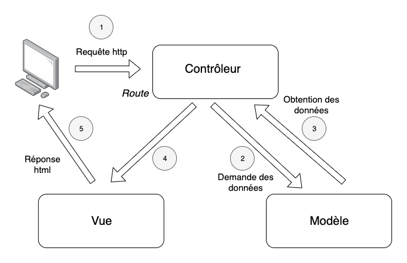
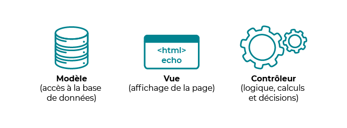

USABILITÉ=
------------
Voici des critères d'usabilité :

-utile ;

-utilisable ;

-navigable ;

-accessible ;

-compréhensible ;

-simple.

----------

UX design=
-
l'UX design est une discipline plus large dont l'objectif est de rendre l'utilisateur heureux, d'offrir une expérience agréable et significative. L'émotion entre en ligne de compte ;

la dimension d'usabilité (englobée dans l'UX design) consiste à permettre aux utilisateurs d'accomplir un ensemble de tâches avec simplicité.

------

Taux de rétention =
-------

la part d'utilisateurs qui continuent d'aller régulièrement sur une app ou un site web plus de 3 mois après l'avoir découvert et utilisé pour la première fois.

-----------
Hook =
----------

Développé par Nir Eyal, professeur à l’école de commerce Stanford, le modèle du crochet (Hook Canvas en anglais) suggère que pour “accrocher ses utilisateurs”, le flow de votre application doit s’articuler en 4 phases qui se complètent et se répètent, formant ainsi une boucle.

Phase 1 : l’élément déclencheur
-------------------------
Selon le modèle du crochet, l’expérience utilisateur commence avec un élément déclencheur. Il en existe deux types :

Les déclencheurs internes tirent l’utilisateur vers l’application. Les plus puissants déclencheurs internes sont des états psychologiques ou des émotions comme :

la solitude 😢 ;

l’ennui 😑 ;

la peur de manquer quelque chose 😧.

Ces sentiments sont souvent négatifs, parce qu’ils sont la manifestation du problème que l’utilisateur cherche à résoudre avec le produit.

Les déclencheurs externes poussent l’utilisateur vers l’application. À force d’y être exposé, vous connaissez déjà :

-la publicité ;

-les notifications ;

-les boutons d’appel à l’action.

-----------------------
Phase 2 : l’action
--------------------
Une fois l’expérience déclenchée, l’utilisateur doit pouvoir passer à l’action souhaitée le plus facilement possible.

En tant que designer, vous avez donc pour mission :

D'éliminer au maximum la friction qui pourrait freiner ou démotiver l’utilisateur (clics superflus, remplissage de champ interminable, lecture sans fin, etc.).

De réduire la charge cognitive, de façon à rendre la prochaine action clairement identifiable.

Pensez-y un instant : quoi de plus simple que de faire défiler un fil de photos sur Instagram (si ce n’est peut-être de laisser la lecture automatique de YouTube choisir la prochaine vidéo) ?

La gratification est instantanée et surtout… elle est imprévisible !

Phase 3 : la récompense variable
--------------------
En se connectant ou en explorant Facebook, Instagram ou YouTube, l’utilisateur ne sait pas exactement ce qu’il va y trouver, et c’est cet élément de surprise qui le pousse à revenir ou à rester plus longtemps sur l'application.

Comme s’il tirait sur le levier d’une machine de casino, l’utilisateur se retrouve constamment tenté de prolonger l’expérience dans l’espoir et l’anticipation d’une “meilleure récompense” ; par exemple descendre un fil d'actualité dans l'espoir de tomber sur un article plus captivant, une photo drôle ou des nouvelles d’un ami proche.

-D’autres exemples de récompenses variables :

-le nombre de mentions “j’aime” ou autres réactions sur une photo ;

-un commentaire sur un statut ;

-la réponse à un message privé ;

un nouvel ami (Facebook), follower (Twitter), une nouvelle relation (LinkedIn) ou affinité (Tinder).

Phase 4 : l’investissement
----------------
Enfin, après l'élément déclencheur, l’action et sa récompense variable, l’utilisateur devrait naturellement être tenté de rentrer dans la 4e et dernière phase du modèle : l’investissement.

À l’inverse d’un produit physique qui se dévalue avec le temps, plus on utilise une application, plus on y crée et on y stocke de la valeur.

Ainsi…

-en rentrant des données (compléter ou mettre à jour un profil),

-en s’abonnant à une page ou à une chaîne,

-en publiant une photo ou vidéo,

-ou encore en envoyant un message privé,

… l’utilisateur augmente ses futures chances d’être récompensé (par rétroaction) et par la même occasion, charge les prochains déclencheurs qui le ramèneront sur l’application.

Et la boucle est bouclée ! 😎

-------------------

L'affordance
---------------
 est la capacité d'un objet ou d'un système à évoquer son utilisation, sa fonction.
Traduit de l'anglais, "affordability" ("afford" (pouvoir se permettre) + "ability" (capacité)) désigne l'accessibilité, le caractère abordable d'un produit ; elle est remise sur le devant de la scène dès qu'une innovation apparaît.

Si une nouvelle innovation prend le pas et s'inspire de la base d'une précédente innovation (que tout le monde a eu le temps de prendre en main), ça passe… et cela ne demande qu'un léger temps d'adaptation.

Par ailleurs, si un nouveau produit est trop innovant, trop en avance sur son temps (et ce, même s'il est génial), il va générer un manque d'affordance :

provoquer auprès des utilisateurs de la confusion, de l'incapacité à prendre en main le produit, de l'incompréhension, voire de la frustration, de la colère… ;

empêcher les utilisateurs de comprendre l'intérêt du produit, les faire rester sur l'acquis (beaucoup plus pratique et simple à leurs yeux), et leur faire fuir la nouveauté.

---------

Sachez que c’est surtout l’utilisateur qui est mobile
Avant de concevoir un produit, vous devez comprendre une chose : votre utilisateur est avant tout mobile.

Qu'est-ce que ça veut dire ? C'est l'utilisateur qui est mobile, et non son téléphone ?

En clair, lorsque l'on parle du "mobile", cela ne désigne pas seulement le fait que les utilisateurs utilisent des appareils qui sont mobiles, mais c'est aussi parce que les usages et les comportements ont changé : on est dans l'ère de la mobilité, on est connecté à Internet partout…

"On ne va pas sur Internet. On est dans Internet" – Joël de Rosnay, futurologue français.

C'est donc l'utilisateur qui est mobile. Il :

se déplace en utilisant son smartphone : il marche, prend les transports… ;

cherche en permanence à avoir un bon réseau, et suffisamment de batterie 😪 ;

communique et capture le réel en instantané : mail, messagerie, mais aussi via la photo, voire la réalité augmentée ;

commence à préférer les images, émojis et autres, plutôt que le texte, parce que cela va plus vite et transmet mieux une émotion ou un message ;

possède plein d’applications mobiles, pour plein de besoins différents ;

son attention est donc divisée (c'est la course pour capter son attention et parvenir à la retenir).

La version desktop de votre site web peut être très jolie et pleine d'effets graphiques mirobolants… n'empêche que votre utilisateur consultera votre site depuis son mobile dans la très grande majorité du temps. Il ne faut pas l'oublier, ni le négliger !

La plupart des gens ne liront pas sagement toutes les pages de votre produit, ils les liront en diagonale en cherchant des yeux l'information qui les intéresse.

Intégrez l’approche du mobile-first
Il y a tellement d’utilisateurs sur mobiles (smartphones et/ou tablettes) que c'est impossible aujourd'hui pour tout designer de n'envisager que la version desktop (ordinateur) : vous devez penser "responsive".

La notion de "responsive" (de l'anglais : qui réagit, qui s'adapte, littéralement) fait référence au principe d'adaptabilité d'un contenu sur différents terminaux (ordinateur, smartphone, tablette). En bref, le contenu doit s'afficher de manière lisible sur différentes tailles d'écrans.

Cela implique que, si on passe de l'ordinateur au smartphone (taille divisée par 10 en moyenne) :

la taille de la police de caractère, des liens, des boutons et autre type de contenu, s'adapte de manière à ce que l'on n'ait pas besoin de zoomer ;

les visuels (images, "slider", photos…) sont redimensionné‌s correctement ;

la disposition du contenu reste claire.

Si vous n'intégrez pas le responsive dans votre approche, non seulement vous êtes "has been" (pas à jour), mais aussi vous aurez du mal à faire voir au monde votre site. En effet, le moteur de recherche Google "punit" les sites non "responsives", c'est-à-dire qu'il pénalise en termes de référencement les sites non compatibles avec le mobile : ils ne remontent pas dans les résultats de recherche.

Il est donc indispensable de :

prévoir une version mobile lorsque l'on développe un site web ;

le coder en intégrant le responsive (encore mieux) ;

commencer (que ce soit code ou maquette graphique) par la version mobile ;

appliquer les bonnes pratiques de ce que j'appellerais le "design pour le pouce" lorsque l'on développe un site web ou une application mobile.

L'approche du "mobile-first", un principe que l'on voit souvent en UX design, consiste à "se débarrasser du problème du mobile" en premier, à traiter les attentes en termes de mobile en premier.

Ce n'est pas tellement que le mobile est un problème, c'est plutôt qu'il s'agit de prendre en considération les contraintes liées au mobile d'abord, pour ensuite passer à la version desktop.

Assimilez les contraintes de l’appareil mobile
Développer pour du mobile demande d'être conscient de plusieurs contraintes dans le processus de conception :

La taille de l’écran est très petite, et l'utilisateur y navigue avec un doigt (souvent le pouce).

Un smartphone s'utilise très souvent en marchant.

Le réseau est aléatoire, parfois bon, parfois fluctuant, faible, voire inexistant…

La batterie des smartphones d'aujourd'hui dure maximum une journée.

Ces quatre contraintes à elles seules permettent déjà de dégager quelques grands principes lorsque l'on doit concevoir une application mobile :

Afficher l'essentiel du contenu, à la bonne taille et au bon endroit.

On fait du design pour le pouce, ne l'oublions pas ! Sur un ordinateur on navigue sur l'écran grâce à un curseur (depuis un trackpad ou une souris), qui est tout petit comparativement à la taille de l'écran et qui, de ce fait, permet un très grand niveau de précision et de contrôle du mouvement. Sur un smartphone, on interagit avec le doigt, beaucoup plus gros en proportion par rapport à l'écran…

Charger rapidement, même quand le réseau n'est pas en 4G.

Ne pas consommer trop d'énergie et donc de batterie.

------------

Le User Flow
----------------
 est une représentation graphique, écrite ou numérique, des chemins qu'il est possible d'emprunter lorsque cet utilisateur navigue sur un site Internet ou une application
 -----------

RETOUR ILOT 3
5 Juillet 2024 

1 - Nommer correctement vos fichiers 
Objectif:
Avoir des fichiers clairs et faciles à identifier.
Simplifier la recherche et l'organisation des fichiers.
Éviter les erreurs et les problèmes de compatibilité.
Règles générales:
Utiliser des noms courts et descriptifs: Le nom du fichier doit refléter son contenu de manière précise et concise. Évitez les noms génériques ou énigmatiques.
Mots-clés: Inclure des mots-clés pertinents dans le nom du fichier pour faciliter la recherche.
Date et version: Si le fichier est susceptible d'être modifié, incluez la date de création ou de la dernière modification dans le nom. Vous pouvez également ajouter un numéro de version pour différencier les itérations.
Caractères autorisés: Limitez-vous aux caractères alphanumériques (_,-,.), les espaces étant déconseillés. Évitez les accents, les cédilles et autres caractères spéciaux.
Cohérence: Adoptez une convention de nommage cohérente pour tous vos fichiers afin de maintenir une organisation uniforme.

2 - Personas : 
Il manque des informations dans vos personas : 
Données démographiques: sexe, localisation, niveau d'éducation
Motivations: Besoins, désirs et attentes vis-à-vis du produit.
Comportements: Comment l'utilisateur utilise les produits technologiques en général.
Scénario d'utilisation: Un exemple concret de comment l'utilisateur utilise le produit pour atteindre ses objectifs.
 3 - User flow :

Vous pourriez améliorer votre USer-Flow en utilisant la nomenclature de ce type de représentation - >   https://boldist.co/usability/ecommerce-user-flow/ 

3 - Wireframe 
Pour améliorer votre user-flow et vos wireframes : 
Sur les wireframes, mettre en évidence les CTA serait judicieux 

