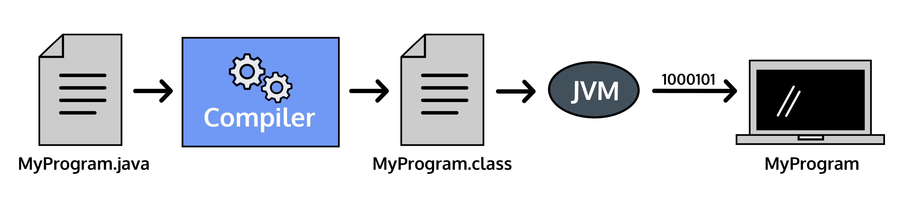
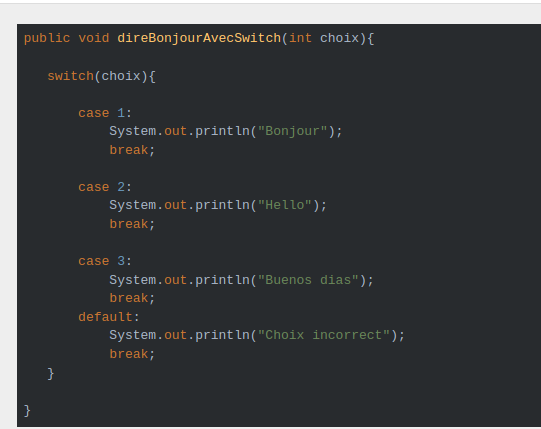
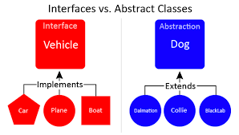
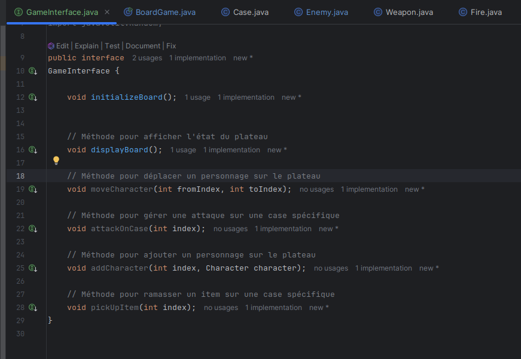
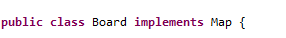
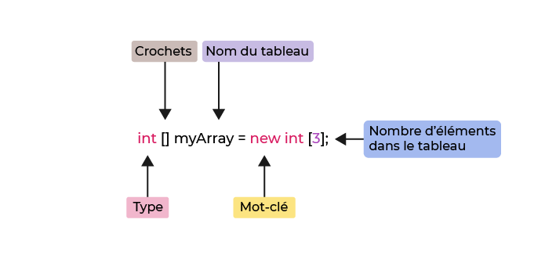

en Java, tout est objet à l’exception des types primitifs (nombres entiers, nombres à virgule flottante, etc.) qui ont cependant leurs variantes qui héritent de l'objet Object (Integer, Float, Double, etc.).
----
les classes 1ere lettre en Majuscule
-
Ligne d’impression
-
System.out.println() peut imprimer sur la console :
-

System est une classe de la bibliothèque de base fournie par Java
--
out est un objet qui contrôle la sortie
-------

println() est une méthode associée à cet objet qui reçoit un seul argument
------

System.out.println("Hello, world!");
// Résultat : Bonjour, tout le monde 

Compilation de Java
En Java, lorsque nous compilons un programme, chaque classe individuelle est convertie en un fichier de classe . , qui est connu comme le code d’octet.

La JVM (machine virtuelle Java)
-
est utilisée pour exécuter le code d’octets.

# Compiler le fichier de classe :
javac hello.java

# Exécuter le fichier compilé :
Espaces
Les espaces, y compris les espaces et les nouvelles lignes, entre les instructions sont ignorés.

System.out.println(« Exemple d’énoncé »);
-

System.out.println(« Another statement »);
-

Relevés
En Java, une instruction est une ligne de code qui exécute une tâche et se termine par un ;.

System.out.println("Java Programming ☕️");
-
main() Méthode
--
En Java, chaque application doit contenir une méthode main(), qui est le point d’entrée de l’application. Toutes les autres méthodes sont appelées à partir de la méthode main().
--

La signature de la méthode est public static void main(String[] args) { }. Elle accepte un seul argument : un tableau d’éléments du type String.
-

public class Personne {

public static void main(String[] args) {

    System.out.println("Hello, world!");

Une classe représente un concept unique.

Un programme Java doit avoir une classe dont le nom est le même que celui du nom de fichier du programme.
-

Dans l’exemple, la classe Person doit être déclarée dans un fichier de programme nommé Person.java.

Une classe représente un concept unique.

Un programme Java doit avoir une classe dont le nom est le même que celui du nom de fichier du programme.

Dans l’exemple, la classe Person doit être déclarée dans un fichier de programme nommé Person.java.

public class Personne {

public static void main(String[] args) {

    System.out.println("Je suis une personne, pas un ordinateur.");

}

}

---------------

Primitive Data Types
--
Java’s most basic data types are known as primitive data types and are in the system by default.

The available types are as follows:

int
char
boolean
byte
long
short
double
float
null is another, but it can only ever store the value null.

int age = 28;
--
char grade = 'A';
-
boolean late = true;
-
byte b = 20;
-
long num1 = 1234567;
-
short no = 10;
-
float k = (float)12.5;
-
double pi = 3.14;
-
String = "blabla";
-

-----------

Increment and Decrement Operators
The increment operator, (++), can increase the value of a number-based variable by 1 while the decrement operator, (--), can decrease the value of a variable by 1.

int numApples = 5;
-
numApples++; // Value is now 6

int numOranges = 5;
-
numOranges--; // Value is now 4

public void 

    "public class Person {
// state of an object

int age;
String name;

// behavior of an object

public void set_value() {

age = 20;

name = "Robin";

}
public void get_value() {

System.out.println("Age is " + age);

System.out.println("Name is " + name);

}

// main method
-

public static void main(String [] args) {

// creates a new Person object

Person p = new Person();

    // changes state through behavior
    p.set_value();
}
}

------

Méthode du constructeur en Java
-
Les classes Java contiennent une méthode de constructeur qui est utilisée pour créer des instances de la classe.
---

Le constructeur porte le nom de la classe. Si aucun constructeur n’est défini, un constructeur vide par défaut est utilisé.
----------

---------------

L'opérateur logique NOT est représenté par !. Cet opérateur nie la valeur d'une expression booléenne.
-

----------------
Opérateur ET
---
L'opérateur logique AND est représenté par &&. Cet opérateur renvoie truesi les boolean expressions des deux côtés de l'opérateur sont égales true; sinon, il renvoie false.
-

L'opérateur OU
-------
L'opérateur logique OR est représenté par ||. Cet opérateur renvoie truesi au moins une des booleanexpressions comparées possède une true valeur ; sinon, il renvoie false.
------
L'opérateur "double"
-
Le mot clé double est un type de données qui peut stocker des nombres fractionnaires de 1,7e−308 à 1,7e+308 .
-----------

-
Systemest une classe Java intégrée qui contient des outils utiles pour nos programmes.
-------
outest l'abréviation de « sortie ».
-----
printlnest l'abréviation de « ligne d'impression ».
------

Compilation = Nous avons un fichier : Welcome.java . Nous compilons avec la commande :
Le terminal n'affiche aucune erreur , ce qui indique une compilation réussie.

javac Welcome.java = compile deux fichier
--
Nous avons maintenant deux fichiers :

Welcome.java , notre fichier original avec la syntaxe Java.
---------
Welcome.class , notre fichier compilé avec bytecode Java, prêt à être exécuté par la machine virtuelle Java.
---------
Nous pouvons exécuter la classe compilée avec la commande :
-
java Welcome
------

-----------

Les programmes Java ont au moins une classe et une main()méthode.
-
Chaque classe représente une idée du monde réel.
-
La main()méthode exécute les tâches du programme.
-
Les commentaires Java ajoutent un contexte utile aux lecteurs humains.
-
Java possède des espaces, des accolades et des points-virgules.
-
Les espaces blancs permettent aux humains de lire facilement le code.
-
Les accolades marquent la portée d'une classe et d'une méthode.
-
Les points-virgules marquent la fin d’une déclaration.
-
Java est un langage compilé.
-
La compilation détecte les erreurs dans notre code.
-
Les compilateurs transforment le code en une classe exécutable.
-

Le chartype de données est utilisé pour stocker un seul caractère. Le caractère doit être entouré de guillemets simples, comme « A » ou « c » :
-

char myGrade = 'B';

System.out.println(myGrade);

----------------

Ajout ( +=)
-
Soustraction ( -=)
-
Multiplication ( *=)
-
Division ( /=)
-
Module ( %=)
-
------------

== (strictement égal)
----
!= (non égal)
-
.equals() = (strictement égal)
-

public class Song {

public static void main(String[] args){

String line1 = "Nah nah nah nah nah nah nah nah nah yeah";

String line2 = "Nah nah nah nah nah nah, nah nah nah, hey Jude";

String line3 = "Nah nah nah nah nah nah, nah nah nah, hey Jude";

System.out.println(line1 .equals (line2));

System.out.println(line2 .equals(line3));

}       
}

------------------

final variables = (constante, valeur qu'on ne peut changer aprés la déclaration)
-

-----------

Math. ceil() 
-
convertit le nombre en l'entier le plus proche supérieur ou égal au nombre donné ; si un entier est passé en argument, le résultat de Math. ceil() sera le même entier, mais comme Math. ceil() renvoie une valeur double, l'entier sera typé en double.5
--
------------------
En Java, la classe Scanner permet à un utilisateur d’écrire du texte et au programme de lire ce texte.
-
La fonction nextLine() en Java renvoie la valeur dans la chaîne, elle renvoie la ligne actuelle qui a été ignorée.
-

Attributs = valeurs dans une classe
-
-----------
toString() = renvoie la sortie souhaitée sur l’objet.
-
Cela dépend de votre implémentation.
-

------------

break
-
L'instruction break permet de terminer la boucle en cours ou l'instruction switch ou label en cours et de passer le contrôle du programme à l'instruction suivant l'instruction terminée.
-
------------
super = super est utilisé afin d'appeler ou d'accéder à des fonctions définies sur l'objet parent,
---
pour appeler un constructeur de superclasse
---------
----------------

yield=
-

Le mot clé yield nous permet de quitter une expression switch en renvoyant une valeur qui devient la valeur de l'expression switch . Cela signifie que nous pouvons attribuer la valeur d'une expression switch à une variable.
-----------------------------
--------------------

Le Switch/Case 
-
est une structure conditionnelle en Java qui vous permet de sélectionner un ensemble d’instructions à exécuter en fonction de la valeur d’une variable. Il s’agit en fait d’une instruction très similaire à l’instruction if de Java, à la différence qu’il offre une syntaxe plus comprimée qui permet d’exprimer facilement plusieurs conditions.
-

Méthode abstraite : Oblige chaque sous-classe à définir son propre calcul de protection.
-

----------------
L'annotation @Override indique en effet que la méthode est héritée de la classe mère ou d'une interface.
-
--------------

Les énumérations permettent de définir un ensemble fini de constantes, chacune d'entre-elles est séparée des autres par une virgule.
-
---------

une interface
-
est un type de référence qui permet de définir un contrat ou un ensemble de méthodes que les classes doivent implémenter. Elle est similaire à une classe abstraite, mais une interface ne peut contenir que des déclarations de méthodes (jusqu'à Java 8, où quelques exceptions ont été ajoutées). Les méthodes d'une interface sont abstraites par défaut, c'est-à-dire qu'elles ne contiennent pas de corps.
-

Voici un exemple basique d'interface :
-

          public interface Vehicule {

                void demarrer();

                void arreter();
                                    }

Contrat de service = Ensemble de méthodes communes pour des classes abstraites
-
body d'une méthode = les instructions a l'intérieur
-

Caractéristiques principales d'une interface :
Pas d'implémentation par défaut : Les méthodes déclarées dans une interface n'ont pas de corps, c'est à la classe qui implémente l'interface de fournir le comportement de ces méthodes.
Implémentation multiple : Une classe peut implémenter plusieurs interfaces, ce qui n'est pas possible avec l'héritage de classes (une classe ne peut hériter que d'une seule autre classe).
Constantes uniquement : Une interface peut contenir des variables, mais celles-ci sont implicitement public, static, et final. Elles sont donc des constantes.
Utilisation de polymorphisme : Les interfaces sont souvent utilisées pour réaliser le polymorphisme en Java. Une instance d'une classe qui implémente une interface peut être traitée comme une instance de cette interface.
Implémentation d'une interface :
Une classe qui implémente une interface doit redéfinir toutes les méthodes de celle-ci.

    public class Voiture implements Vehicule {

    @Override
    public void demarrer() {
        System.out.println("La voiture démarre.");
    }

    @Override
    public void arreter() {
        System.out.println("La voiture s'arrête.");
    }
}

----------------------------
INSTANCE
-
Une instance est une mise en application d’une classe. Comparaison proposée :Une classe = un modèle 3D d’une moto. Une instance est une des motos qui a été créée à partir du modèle. Elle va vivre sa vie. La moto A et la moto B sont issues du même modèle donc de la même classe, elles vont avoir les mêmes fonctions, propriétés, mais les valeurs de leurs attributs vont changer. La moto A peut être bleue et avoir 120 000 km alors que la moto B est rouge et vient de sortir d’usine. Ce sont deux instances d’une même classe.|

#VISIBILITE
-
La visibilité d’une fonction ou d’une variable permet de restreindre ou d’ouvrir son utilisation.Il en existe 3On va faire des exemples avec une classe Car avec une propriété plateNumberpublic : La propriété va être accessible depuis n’importe quel endroit.On peut donc faireprivate : La propriété n’est accessible qu’à l’intérieur de la classe où elle est définie On ne peut plus faireOn doit passer par un getter/setter :  Est à mi-chemin entre private et protected, elle ne sera accessible que par les classes situées dans le même package (ici le même package que Car) ou par les classe qui vont en hériter (extends Car)

#STATIC
-
La plupart des classes sont faites pour être instanciées avec un constructeur. Exemple new Car(). Ce sont des classes qui vont évoluer avec le temps et qui ont des valeurs qui vont changer. Certaines classes plus utilitaires ne vont pas avoir d’instanciation car les valeurs de leurs attributs ne changent pas (ce sont des constantes). Il est possible d’utiliser des méthodes d’une classe sans l’instancier cependant il faut que toutes les variables de cette méthode et la méthode elle-même soient « static » c’est-à-dire qu’elles ne changent pas de comportement en fonction du contexte. On peut imaginer une classe de transformation de fichiers :
On voit une méthode convertXlsxToPdf qui prend un paramètre et va effectuer des opérations dessus. Il n’y a pas besoin de stocker quoi que ce soit comme donnée dans la classe de conversion. D’où le passage en static. On peut l’appeler sans utiliser le newOn applique la méthode directement sur le nom de classe PdfTransformer. C’est souvent pratique dans le Pattern Singleton par exemple.

#ANNOTATION
-
Les annotations servent dans certains framework afin d’aller plus vite dans le développement ou pour ajouter de la documentation. Ils commencent par @

#IMPORTS
-
Les imports sont la liste des classes (complètes avec la déclaration du package) utilisées dans la classe que nous créons.

#HERITAGE
-
On n’aime pas dupliquer du code. Dans cette optique, on essaie de mutualiser. Quand on a plusieurs classes avec des méthodes ou attributs en commun, on créer une classe commune, qu’on appelle classe mère. Exemple piqué sur le net :
Dans ce cas on dit de la classe Chien qu’elle hérite de la classe Animal. A noter qu’une classe ne peut étendre qu’une autre classe.|

#🔣 Mots clés
-
On utilise le mot clé extends pour signifier que la classe actuelle hérite d’une autre classe.
Ici la classe Gobelin hérite de la classe Enemy. Ce qui veut dire qu’elle possède naturellement tous les attributs et méthodes de la casse Ennemy.|

#OVERRIDE
--

C’est une annotation dans une classe fille qui indique qu’on implémente la méthode (abstraite ou non) de la classe mère afin de changer son fonctionnement.Dans cet exemple, nous avons surchargé la méthode getHeroes() de la classe parent.|

#CLASSE ABSTRAITE
-

Une classe abstraite est une classe un peu spéciale. Elle ne peut pas être instanciée, elle est vouée à être héritée. On s’en sert principalement pour factoriser le code (donc le mutualiser). On ajoute le mot clé abstract sur la définition de la classe. On peut forcer les classes filles à implémenter des fonctions en écrivant abstract devant des méthodes. Dans ce cas, la classe fille qui en hérite aura accès à toutes les méthodes de la classe mère mais devra surcharger les méthodes « abstraites ». Voici un exemple :
On a une classe abstraite Language. On ne peut donc pas faire new Language() ; On est obligé de créer des classes qui en hérite. Cette classe contient une method2 qui est fonctionnelle (avec un corps de méthode et pas de mot clé abstract) et une méthode1 qui n’a pas de corps, qui doit donc être réécrite dans la classe fille. (Souvent l’IDE vous souligne en disant « Add unimplemented methods »)

#INTERFACE
-

Une interface est un descriptif d’une classe. On appelle ça souvent un contrat.Ca peut être vu de loin comme une classe hyper abstraite donc avec aucun corps de méthode.Il est possible d’implémenter plusieurs interfaces.

Le mot clé « super »
-
permet depuis une classe fille d’appeler une classe mère. Par exemple, quand une classe mère a un constructeur vide, lorsque nous allons créer notre constructeur de la classe fille, la première ligne sera super() qui appelle le constructeur de la classe mère. Nous pouvons appeler d’autres méthodes de cette classe comme

             super.alphaMethod1()
qui appellera la méthode alphaMethod1 de la classe mère.

--------------

 